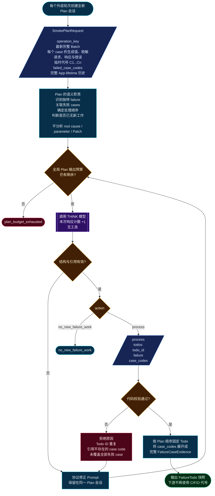
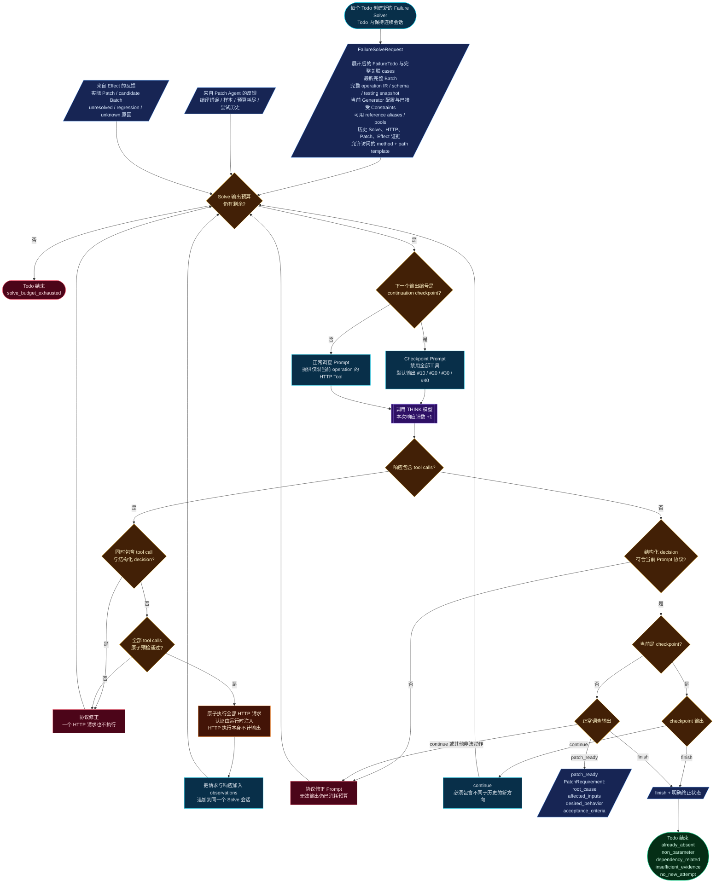
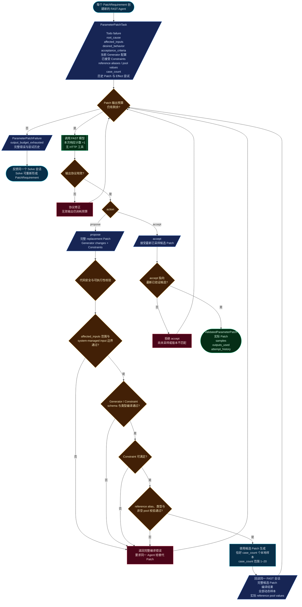
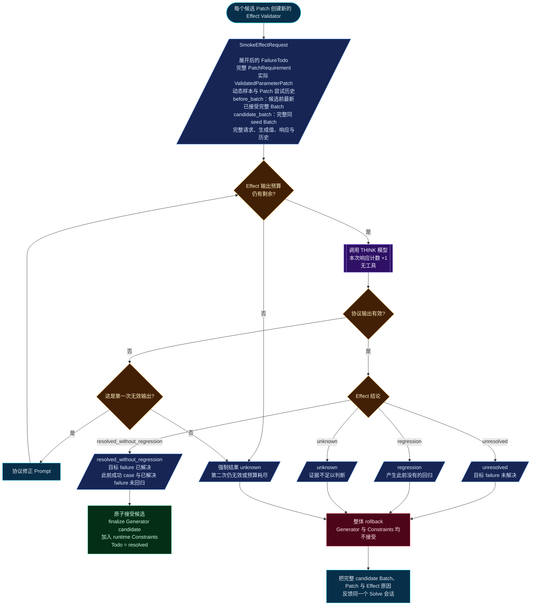
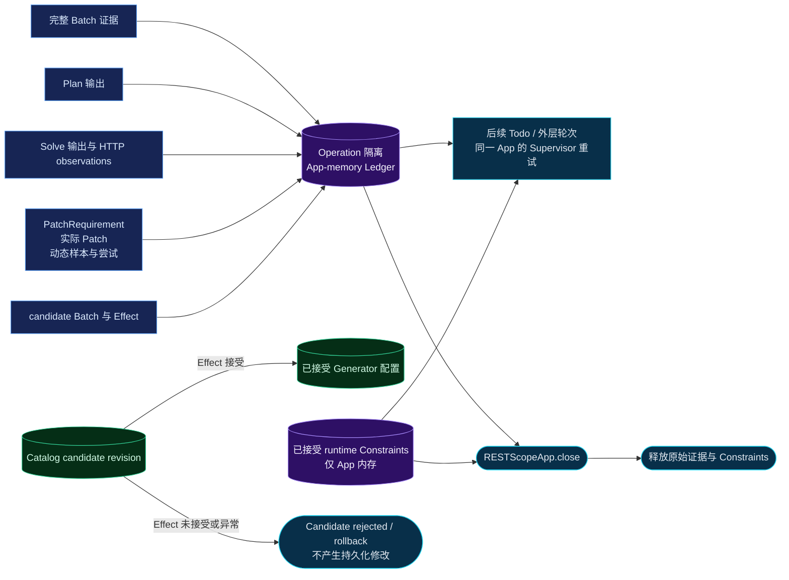

# LLM 主导的 Operation Smoke 重构流程

本文描述重构后的 Operation Smoke 运行逻辑。阅读顺序：

1. 先看“总流程”，理解外层 Batch、固定 Todo、候选 Patch 和下一轮之间的关系。
2. 再看 Plan、Solve、Patch、Effect 四个 Agent 的协议图。
3. 最后查阅请求字段、预算、终止状态和 App 生命周期状态表。

## 1. 总流程

```mermaid
flowchart TD
    START([收到 OperationSmokeRequest])
    LOAD[读取 operation 与 testing 配置]
    LOAD_RESULT{读取结果}
    DB_ERROR([数据库异常<br/>上抛为 Supervisor 全局技术错误])
    OP_ERROR([OperationSmokeResult<br/>status = errored<br/>stop_reason = operation_error])
    RECOVER[恢复可能遗留的 Catalog candidate]
    ENABLED{Operation Smoke<br/>已启用且受支持?}
    UNSUPPORTED([OperationSmokeResult<br/>status = unsupported<br/>stop_reason = unsupported_operation])
    INIT[初始化本次 Smoke run<br/>固定 seed<br/>加载 operation 隔离历史<br/>加载已接受 runtime Constraints]
    REF_POOL{配置要求的 reference pool<br/>均非空?}
    FULL_BATCH[运行当前已接受配置的完整 Batch<br/>固定 seed + case_count<br/>完整 preflight / serialization / HTTP / Behavior Monitor]
    REVISION_OK{执行报告使用的<br/>Catalog revision 正确?}
    RATE{最新完整 Batch 的<br/>2xx success rate<br/>>= threshold?}
    PASSED([OperationSmokeResult<br/>status = passed])
    PLAN_BUDGET{全局 Plan 输出预算<br/>仍有剩余?}
    PLAN_EXHAUSTED([OperationSmokeResult<br/>status = retry<br/>stop_reason = plan_budget_exhausted])
    RECORD_BATCH[把完整 Batch、failure/case 快照<br/>写入 operation 隔离 App 内存账本]
    PLAN[[P. 新建 smoke_plan THINK 会话<br/>输入完整 Batch + 临时代号 + 历史]]
    PLAN_RESULT{Plan 结果}
    NO_WORK([OperationSmokeResult<br/>status = retry<br/>stop_reason = no_new_failure_work])
    EXPAND[验证代号引用与失败 case 覆盖<br/>将 Todo 中的 case code 立即展开为完整证据<br/>固定本轮 Todo 顺序]
    TODO_LEFT{本轮固定 Todo<br/>还有未处理项?}
    ROUND_DONE[记录 Round summary<br/>本轮之后出现的新 failure<br/>留给下一轮 Plan]
    SELECT_TODO[选择下一个 Todo<br/>读取最新已接受 Batch<br/>重新计算可用 references]
    SOLVE[[S. 为该 Todo 新建 failure_solver THINK Agent<br/>Todo 内保持连续会话]]
    SOLVE_RESULT{Solve 输出}
    TODO_FINISH[记录 Todo 终止状态<br/>already_absent / non_parameter / dependency_related<br/>insufficient_evidence / no_new_attempt / solve_budget_exhausted]
    PATCH_REQ[/PatchRequirement<br/>root_cause<br/>affected_inputs<br/>desired_behavior<br/>acceptance_criteria/]
    PATCH[[A. 新建 parameter_patch FAST Agent]]
    PATCH_RESULT{Patch Agent 结果}
    PATCH_FAILED[记录 Patch 失败与完整尝试历史]
    PREPARE[准备候选修改<br/>扩展 generator presence closure<br/>组合候选 runtime Constraints]
    HAS_GENERATOR{包含 Generator 修改?}
    STAGE[stage Catalog candidate revision]
    NO_STAGE[仅在内存中应用候选 Constraints]
    CANDIDATE_BATCH[运行完整 candidate Batch<br/>与 before Batch 使用相同 seed / case_count]
    CANDIDATE_REV{candidate report 的<br/>revision 正确?}
    EFFECT[[E. 新建 smoke_effect THINK Agent<br/>比较 before Batch 与 candidate Batch]]
    EFFECT_RESULT{Effect 结论}
    ACCEPT[原子接受全部候选<br/>finalize Generator candidate<br/>加入 App-lifetime Constraints<br/>latest Batch = candidate Batch<br/>Todo = resolved]
    ROLLBACK[整体 rollback candidate<br/>不接受任何候选 Constraint]
    FEEDBACK[把实际 Patch、candidate Batch、Effect 原因<br/>反馈到同一个 Solve 会话]
    CLEANUP[若已 stage candidate<br/>先执行 best-effort rollback]
    TECH_KIND{异常类型}

    START --> LOAD --> LOAD_RESULT
    LOAD_RESULT -->|数据库异常| DB_ERROR
    LOAD_RESULT -->|operation 范围异常| OP_ERROR
    LOAD_RESULT -->|成功| RECOVER --> ENABLED
    ENABLED -->|否| UNSUPPORTED
    ENABLED -->|是| INIT --> REF_POOL
    REF_POOL -->|否| OP_ERROR
    REF_POOL -->|是| FULL_BATCH --> REVISION_OK
    REVISION_OK -->|否| CLEANUP
    REVISION_OK -->|是| RATE
    RATE -->|是| PASSED
    RATE -->|否| PLAN_BUDGET
    PLAN_BUDGET -->|否| PLAN_EXHAUSTED
    PLAN_BUDGET -->|是| RECORD_BATCH --> PLAN --> PLAN_RESULT
    PLAN_RESULT -->|no_new_failure_work| NO_WORK
    PLAN_RESULT -->|plan_budget_exhausted| PLAN_EXHAUSTED
    PLAN_RESULT -->|planned| EXPAND --> TODO_LEFT
    TODO_LEFT -->|否| ROUND_DONE --> FULL_BATCH
    TODO_LEFT -->|是| SELECT_TODO --> SOLVE --> SOLVE_RESULT
    SOLVE_RESULT -->|明确结束| TODO_FINISH --> TODO_LEFT
    SOLVE_RESULT -->|patch_ready| PATCH_REQ --> PATCH --> PATCH_RESULT
    PATCH_RESULT -->|编译失败 / 预算耗尽| PATCH_FAILED --> SOLVE
    PATCH_RESULT -->|ValidatedParameterPatch| PREPARE --> HAS_GENERATOR
    HAS_GENERATOR -->|是| STAGE --> CANDIDATE_BATCH
    HAS_GENERATOR -->|否| NO_STAGE --> CANDIDATE_BATCH
    CANDIDATE_BATCH --> CANDIDATE_REV
    CANDIDATE_REV -->|否| CLEANUP
    CANDIDATE_REV -->|是| EFFECT --> EFFECT_RESULT
    EFFECT_RESULT -->|resolved_without_regression| ACCEPT --> TODO_LEFT
    EFFECT_RESULT -->|unresolved / regression / unknown| ROLLBACK --> FEEDBACK --> SOLVE
    FULL_BATCH -. 技术异常 .-> TECH_KIND
    STAGE -. 技术异常 .-> CLEANUP
    CANDIDATE_BATCH -. 技术异常 .-> CLEANUP
    EFFECT -. 技术异常 .-> CLEANUP

    CLEANUP --> TECH_KIND
    TECH_KIND -->|SQLAlchemyError| DB_ERROR
    TECH_KIND -->|其他 operation 异常| OP_ERROR

    classDef process fill:#082f49,stroke:#22d3ee,color:#e2e8f0;
    classDef llm fill:#2e1065,stroke:#a78bfa,color:#f5f3ff;
    classDef decision fill:#422006,stroke:#fbbf24,color:#fef3c7;
    classDef success fill:#052e16,stroke:#34d399,color:#d1fae5;
    classDef failure fill:#4c0519,stroke:#fb7185,color:#ffe4e6;
    classDef data fill:#172554,stroke:#60a5fa,color:#dbeafe;
    classDef neutral fill:#1e293b,stroke:#94a3b8,color:#e2e8f0;

    class START,LOAD,RECOVER,INIT,FULL_BATCH,RECORD_BATCH,EXPAND,ROUND_DONE,SELECT_TODO,PREPARE,STAGE,NO_STAGE,CANDIDATE_BATCH,FEEDBACK process;
    class PLAN,SOLVE,PATCH,EFFECT llm;
    class LOAD_RESULT,ENABLED,REF_POOL,REVISION_OK,RATE,PLAN_BUDGET,PLAN_RESULT,TODO_LEFT,SOLVE_RESULT,PATCH_RESULT,HAS_GENERATOR,CANDIDATE_REV,EFFECT_RESULT,TECH_KIND decision;
    class PASSED,ACCEPT success;
    class DB_ERROR,OP_ERROR,PLAN_EXHAUSTED,PATCH_FAILED,ROLLBACK,CLEANUP failure;
    class PATCH_REQ data;
    class UNSUPPORTED,NO_WORK,TODO_FINISH neutral;
```



### 总流程的关键语义

- 一次 Smoke run 始终复用同一个 seed；Supervisor 发起的新重试在未显式指定 seed 时生成新 seed。
- 每轮 Plan 产出的 Todo 是固定快照。当前轮处理过程中出现的新 failure 只进入下一轮 Plan。
- 本轮后续 Todo 使用最新已接受 Batch，因此可以由 Solve 返回 `already_absent`。
- Todo 结束不表示 Smoke 通过。只有最新完整 Batch 达到 2xx 阈值才返回 `passed`。
- Generator 和 Constraint 作为一个候选整体接受或整体回滚，不存在 Group 级或输入级部分接受。

## 2. Plan Agent 协议



Plan 的代码只检查结构、引用存在性和失败 case 覆盖，不判断两个 failure 在语义上是否真的独特。语义去重由 Plan 根据完整历史负责。

## 3. Failure Solver 协议



### HTTP Tool 的代码边界

- 只有 Failure Solver 能调用 HTTP Tool。
- 请求只能使用当前 operation 的 HTTP method 和 path template。
- 同一模型输出内的全部 tool calls 会先统一预检；任何一个无效时，一个也不执行。
- tool-call 模型响应计入 Solve 输出预算，实际 HTTP 执行不计入。
- 正常输出不能混合 tool call 和结构化决定。

## 4. Parameter Patch Agent 协议



Patch Agent 只负责生成和自审候选 Patch，不直接修改 Catalog 或数据库。真正的 candidate stage、完整 Batch 和原子验收由 OperationSmokeAgent 协调。

## 5. Effect Validator 协议



`resolved_without_regression` 是唯一接受候选 Patch 的结果。代码不再使用“全局成功率提高”作为强制接受条件，也不允许部分接受。

## 6. LLM 输入输出与预算总表

| 角色 | 会话生命周期 | 必需输入 | 允许输出 | 工具 | 默认输出预算 |
|---|---|---|---|---|---:|
| `smoke_plan` / THINK | 每个外层轮次全新会话 | 完整 Batch、临时代号、所有失败 case、完整历史 | `process(todos)` 或 `no_new_failure_work` | 无 | 50，跨外层轮次累计 |
| `failure_solver` / THINK | 每个 Todo 新 Agent；Todo 内连续 | 展开 Todo、最新 Batch、operation IR、Generator、Constraints、references、完整历史 | HTTP tool calls；`patch_ready`；`finish`；checkpoint 的 `continue` | 当前 operation HTTP Tool | 50 / Todo |
| `parameter_patch_agent` / FAST | 每个 PatchRequirement 新 Agent | 根因、PatchRequirement、当前配置、Constraints、reference pools、case_count、历史 | `propose` 或看到编译样本后的 `accept` | 无 | 20 / PatchRequirement |
| `smoke_effect` / THINK | 每个候选 Patch 新 Agent | Todo、Requirement、实际 Patch、before/candidate Batch、历史 | `resolved_without_regression`、`unresolved`、`regression`、`unknown` | 无 | 2 / candidate |

所有 LLM 响应都计入对应预算，包括：

- 有效结构化输出；
- 无效 JSON 或无效字段；
- 包含 tool calls 的输出；
- 协议修正后的再次输出。

HTTP 请求的实际执行不计为 LLM 输出。

## 7. 请求字段

| 字段 | 默认值 | 含义 |
|---|---:|---|
| `operation_key` | 必填 | 本次测试的 operation |
| `case_count` | `10` | 每个完整 Batch 和 Patch 动态样本数量，范围 1–20 |
| `success_rate_threshold` | `0.8` | 最新完整 Batch 达到该 2xx 比例才允许 `passed` |
| `seed` | 可选 | 同一次 Smoke run 始终复用；未提供时自动生成 |
| `max_plan_outputs` | `50` | Plan 跨外层轮次的总输出预算 |
| `max_solve_outputs_per_todo` | `50` | 每个 Todo 的 Solve 输出预算 |
| `max_patch_outputs` | `20` | 每个 PatchRequirement 的 Patch Agent 输出预算 |
| `max_effect_outputs` | `2` | 每次 Effect 验证的输出预算 |
| `continuation_interval` | `10` | Solve 每隔多少次输出进入无工具继续检查 |

## 8. Solve Todo 终止状态

| 状态 | 含义 |
|---|---|
| `resolved` | 候选 Patch 已通过 Effect 并被原子接受 |
| `already_absent` | 使用最新 Batch 时该 failure 已不存在 |
| `non_parameter` | 不是参数生成或 Constraint 可以修复的问题 |
| `dependency_related` | 属于 operation dependencies，当前 Todo 不继续 |
| `insufficient_evidence` | 证据不足，无法形成可靠的新调查或 Patch |
| `no_new_attempt` | 账本中没有尚未尝试的新方向 |
| `solve_budget_exhausted` | Solve 达到硬输出预算 |

## 9. App 生命周期状态与持久化



- Generator 修改通过 Catalog candidate revision 持久化。
- 已接受 Constraint 只保存在 App 内存中，可跨 Todo、轮次和同一 App 的 Supervisor 重试。
- App 关闭后，原始响应、LLM 调查历史和 runtime Constraints 全部释放。
- 不新增数据库表，不持久化 LLM reasoning、计划、队列或一般 Agent memory。

## 10. Prompt 上下文装载

Prompt 输入预算：

```text
context_window_tokens - max_tokens - 2048
```

默认：

- `context_window_tokens = 131072`
- `max_tokens = 8192`
- 启动时必须满足 `max_tokens < context_window_tokens`

装载优先级：

1. 当前 Todo；
2. 最新完整 Batch；
3. operation/schema/testing 配置；
4. 当前连续 Solve/Patch 会话；
5. 最近一次 Effect；
6. 旧历史按从新到旧装载。

只有超过上下文窗口时才摘要旧历史。单个当前响应仍然超限时，保留数据结构、原始大小、头尾内容，并显式标记 `context_truncated`。
