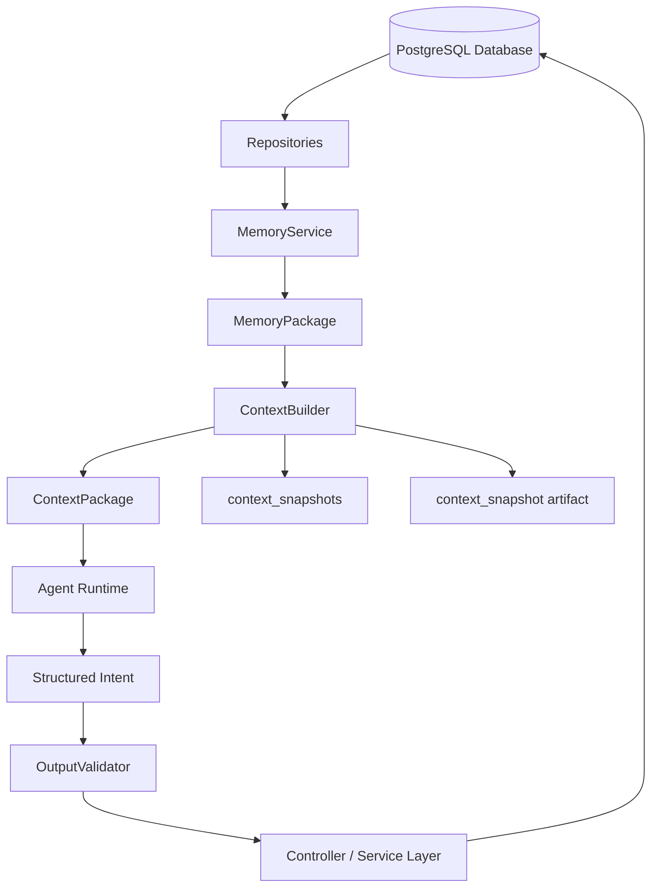
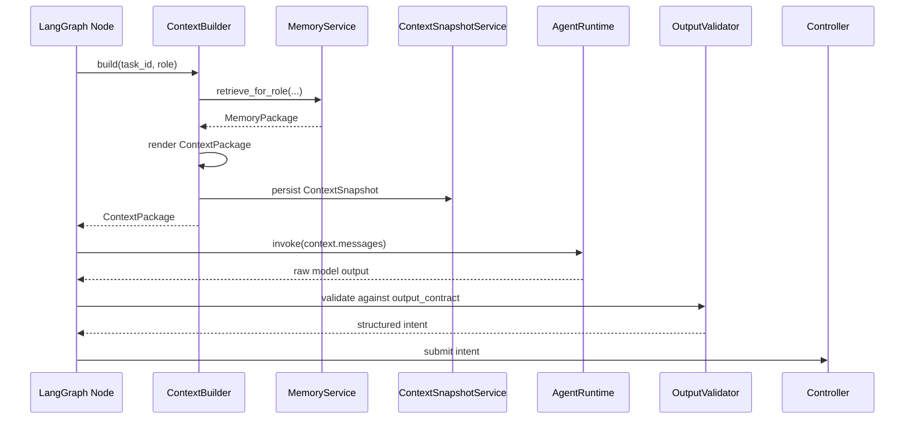

依据你前面已经确定的 DB / Memory 边界，我把 Context 模块单独整理成一份设计书：Memory 的读路径是 `MemoryService → MemoryPackage → ContextBuilder → ContextPackage → context_snapshots → Agent`，并且 ContextBuilder 的写入边界是 `context_snapshots`、`artifacts`、`event_log`，不是业务事实表。 数据库设计中也明确了 `context_snapshots` 是某次 Agent 调用前看到的输入快照，和长期存在的 `operation_intelligence` 不同。

# Agentic API Tester Context 模块设计书

## 1. 设计目标

Context 模块用于定义 **Agent 每次调用前看到什么、以什么格式看到、如何约束输出、如何保存上下文快照用于审计与回放**。

在系统分层中，Context 模块位于 Memory 之上、Agent Runtime 之下：

```text
Database
→ Repository
→ Memory Store
→ MemoryService
→ MemoryPackage
→ ContextBuilder
→ ContextPackage
→ ContextSnapshot
→ Agent Runtime
→ Structured Intent
```

Context 模块的核心目标是：

```text
把 MemoryService 返回的 MemoryPackage，
按照不同 Agent role 的任务目标，
渲染成 prompt-ready 的 ContextPackage，
并将本次 Agent 输入保存为可审计、可回放的 Context Snapshot。
```

---

## 2. 核心原则

```text
Database = 保存事实
Memory = 选择、排序、压缩测试经验
Context = 构造单次 Agent 调用输入
Agent = 基于 Context 输出结构化意图
Controller / Service = 校验并写库
```

Context 模块必须遵守以下原则：

```text
1. Context 不直接替代 Memory。
2. Context 不直接从大量 Repository 拼装上下文。
3. Context 不直接更新 operation_intelligence。
4. Context 不直接写 test_observations。
5. Context 不直接创建 campaigns。
6. Context 不直接修改 agent_tasks.state。
7. Context 不调用 Schemathesis。
8. Context 不调用 LLM。
9. Context 必须保留 source_refs，支持审计和 replay。
10. Context Snapshot 是一次 Agent 输入记录，不是长期记忆。
```

---

## 3. Context 在系统中的位置



---

## 4. Context 与其他模块的边界

| 模块                   | 输入                        | 输出               |       是否写业务表 | 核心职责          |
| -------------------- | ------------------------- | ---------------- | -----------: | ------------- |
| Repository           | SQL 查询参数                  | database records |            否 | 读取数据库         |
| MemoryService        | task/schema/role          | `MemoryPackage`  |            否 | 选择、排序、压缩测试经验  |
| ContextBuilder       | `MemoryPackage`           | `ContextPackage` | 间接写 snapshot | 渲染单次 Agent 输入 |
| AgentRuntime         | `ContextPackage.messages` | raw model output |            否 | 调用模型          |
| OutputValidator      | raw output                | Pydantic object  |            否 | 校验结构化输出       |
| Controller / Service | structured intent         | database updates |            是 | 状态迁移、写库       |

---

## 5. Context 模块不应该做什么

### 5.1 不直接查大量数据库

不推荐：

```python
operations = operation_repo.list_all(schema_id)
observations = observation_repo.list_all(schema_id)
campaigns = campaign_repo.list_all(task_id)
```

推荐：

```python
memory_package = memory_service.retrieve_for_planner(
    task_id=task_id,
    schema_id=schema_id,
    token_budget=6000,
)
```

原因：

```text
Memory 已经负责检索、排序、压缩。
Context 如果绕过 Memory，就会破坏 Database / Memory / Context 的分层。
```

---

### 5.2 不写业务事实

Context 模块不允许：

```text
1. INSERT test_observations
2. UPDATE operation_intelligence
3. INSERT campaigns
4. UPDATE agent_tasks.state
5. UPDATE test_checks
6. 写 learned constraints
```

Context 模块只允许通过 `ContextSnapshotService` 写：

```text
1. artifacts
2. context_snapshots
3. event_log
```

---

### 5.3 不做测试环境审批

MVP 阶段默认：

```text
unrestricted live testing
```

因此 Context 不应该向 Planner 注入以下审批式约束：

```text
1. DELETE 需要 approval
2. POST / PUT / PATCH 需要 allow_write
3. destructive update 需要 allow_delete
4. 必须 dry-run
5. 必须 mock
6. 必须 schema-only
```

Context 可以提醒 Planner：

```text
当前系统是测试 Agent；
GET / POST / PUT / PATCH / DELETE 都是合法测试目标；
计划必须符合预算、operation_id、runner config 和测试目标。
```

---

## 6. Context 模块目录设计

推荐目录：

```text
src/agentic_api_tester/context/
├── __init__.py
│
├── schemas.py
├── context_builder.py
├── context_policy.py
├── context_budget.py
├── context_renderer.py
├── context_snapshot_service.py
├── context_serializer.py
├── prompt_registry.py
│
├── sections/
│   ├── __init__.py
│   ├── role_instruction_section.py
│   ├── task_state_section.py
│   ├── test_goal_section.py
│   ├── budget_section.py
│   ├── operation_targets_section.py
│   ├── operation_risk_section.py
│   ├── observation_section.py
│   ├── campaign_history_section.py
│   ├── current_campaign_result_section.py
│   ├── episodic_section.py
│   ├── constraint_section.py
│   ├── testing_knowledge_section.py
│   ├── tool_affordance_section.py
│   ├── execution_assumption_section.py
│   └── output_contract_section.py
│
├── roles/
│   ├── __init__.py
│   ├── planner_context.py
│   ├── result_analyst_context.py
│   ├── decision_maker_context.py
│   ├── check_designer_context.py
│   └── intelligence_updater_context.py
│
└── templates/
    ├── planner_v1.md
    ├── result_analyst_v1.md
    ├── decision_maker_v1.md
    ├── check_designer_v1.md
    └── intelligence_updater_v1.md
```

MVP 简化版：

```text
context/
├── schemas.py
├── context_builder.py
├── context_policy.py
├── context_budget.py
├── context_renderer.py
├── context_snapshot_service.py
└── roles/
    ├── planner_context.py
    ├── result_analyst_context.py
    └── decision_maker_context.py
```

---

## 7. 核心对象设计

### 7.1 `ContextRole`

```python
from typing import Literal

ContextRole = Literal[
    "planner",
    "result_analyst",
    "decision_maker",
    "check_designer",
    "intelligence_updater",
]
```

MVP 阶段优先实现：

```text
planner
result_analyst
decision_maker
```

后续再实现：

```text
check_designer
intelligence_updater
```

---

### 7.2 `ContextSectionKind`

```python
from typing import Literal

ContextSectionKind = Literal[
    "role_instruction",
    "task_state",
    "test_goal",
    "budget",
    "operation_targets",
    "operation_risk_profile",
    "historical_observations",
    "campaign_history",
    "current_campaign_result",
    "recent_events",
    "learned_constraints",
    "available_checks",
    "testing_knowledge",
    "tool_affordances",
    "execution_assumptions",
    "output_contract",
]
```

说明：

```text
execution_assumptions 用于表达测试运行前提。
MVP 中应明确：unrestricted live testing，所有 HTTP method 都允许测试。
```

---

### 7.3 `SourceRef`

```python
from pydantic import BaseModel


class SourceRef(BaseModel):
    source_table: str
    source_id: str

    field: str | None = None
    artifact_uri: str | None = None
    note: str | None = None
```

示例：

```json
{
  "source_table": "test_observations",
  "source_id": "obs_001",
  "field": "request_summary_json",
  "artifact_uri": "artifact://reproducer/obs_001"
}
```

---

### 7.4 `ContextSection`

```python
from typing import Any
from pydantic import BaseModel, Field


class ContextSection(BaseModel):
    kind: ContextSectionKind
    title: str

    content: str
    structured: dict[str, Any] = Field(default_factory=dict)

    priority: int = 50
    required: bool = False
    estimated_tokens: int = 0

    source_refs: list[SourceRef] = Field(default_factory=list)
```

说明：

```text
ContextSection 是 ContextPackage 的组成单元。
它既可以被 Markdown renderer 渲染，也可以保留 structured 数据用于 replay/debug。
```

---

### 7.5 `ContextMessage`

```python
from typing import Literal
from pydantic import BaseModel


MessageRole = Literal["system", "user", "assistant"]


class ContextMessage(BaseModel):
    role: MessageRole
    content: str
```

MVP 推荐每次 Agent 调用生成两个 message：

```text
system message:
  role 指令、边界、禁止行为、输出要求。

user message:
  当前任务、测试目标、Memory 渲染内容、输出 schema。
```

---

### 7.6 `OutputContract`

```python
from typing import Any
from pydantic import BaseModel


class OutputContract(BaseModel):
    name: str
    description: str

    json_schema: dict[str, Any]

    required: bool = True
    validation_hint: str | None = None
```

示例：

```json
{
  "name": "TestCampaignSpec",
  "description": "Planner must output the next Schemathesis campaign plan.",
  "required": true
}
```

---

### 7.7 `ContextPackage`

```python
from typing import Any
from pydantic import BaseModel, Field


class ContextPackage(BaseModel):
    id: str

    task_id: str
    schema_id: str
    role: ContextRole
    cycle_index: int

    prompt_version: str
    model_name: str | None = None

    sections: list[ContextSection] = Field(default_factory=list)
    messages: list[ContextMessage] = Field(default_factory=list)

    output_contract: OutputContract

    source_refs: dict[str, list[str]] = Field(default_factory=dict)

    estimated_tokens: int = 0
    token_budget: int

    artifact_uri: str | None = None
    checksum: str | None = None

    metadata: dict[str, Any] = Field(default_factory=dict)
```

---

### 7.8 `ContextBuildRequest`

```python
from pydantic import BaseModel, Field


class ContextBuildRequest(BaseModel):
    task_id: str
    schema_id: str
    role: ContextRole

    campaign_id: str | None = None
    operation_ids: list[str] = Field(default_factory=list)

    model_name: str | None = None
    prompt_version: str | None = None
    token_budget: int | None = None

    debug: bool = False
    force_include_source_tables: list[str] = Field(default_factory=list)
```

---

## 8. ContextPolicy 设计

`ContextPolicy` 决定：

```text
1. 某个 role 需要哪些 section。
2. 哪些 section 必须存在。
3. 每个 section 的 token budget。
4. 输出契约是什么。
5. prompt_version 是什么。
```

### 8.1 数据结构

```python
from pydantic import BaseModel


class SectionPolicy(BaseModel):
    kind: ContextSectionKind
    required: bool
    max_tokens: int
    priority: int


class ContextPolicy(BaseModel):
    role: ContextRole
    prompt_version: str
    default_token_budget: int

    section_policies: list[SectionPolicy]

    output_contract_name: str
```

---

## 9. 不同 Role 的 Context 策略

## 9.1 Planner Context

Planner 需要回答：

```text
下一轮应该测什么？
为什么测这些 operation？
用什么 campaign_type？
预算怎么分配？
期望学到什么？
```

Planner 输入应包含：

| Section                   | 必须 | 说明                        |
| ------------------------- | -: | ------------------------- |
| `role_instruction`        |  是 | Planner 只负责生成测试计划         |
| `task_state`              |  是 | 当前 task state、cycle、当前假设  |
| `test_goal`               |  是 | 用户目标、测试范围                 |
| `budget`                  |  是 | 剩余轮次、case 数、timeout       |
| `operation_targets`       |  是 | 候选 operation              |
| `operation_risk_profile`  |  是 | 静态 / 动态风险                 |
| `historical_observations` |  是 | 历史失败摘要                    |
| `campaign_history`        |  是 | 避免重复低收益测试                 |
| `tool_affordances`        |  是 | Schemathesis / MCP 能力     |
| `execution_assumptions`   |  是 | unrestricted live testing |
| `output_contract`         |  是 | `TestCampaignSpec`        |

Planner 不需要：

```text
1. 完整 raw logs。
2. 完整 request/response。
3. 数据库 schema 细节。
4. 审批规则。
5. Agent 内部推理历史。
```

---

## 9.2 ResultAnalyst Context

ResultAnalyst 需要回答：

```text
这次 campaign 结果说明了什么？
哪些 failure 是新 observation？
哪些是重复 observation？
哪些像 flake？
哪些像 spec issue？
哪些像 environment issue？
```

ResultAnalyst 输入应包含：

| Section                   | 必须 | 说明                   |
| ------------------------- | -: | -------------------- |
| `role_instruction`        |  是 | 只分析结果，不写库            |
| `task_state`              |  是 | 当前 task 与 campaign   |
| `current_campaign_result` |  是 | 本次 Schemathesis 解析结果 |
| `operation_targets`       |  是 | 本轮测试过的 operation     |
| `operation_risk_profile`  |  是 | 被测 operation 背景      |
| `historical_observations` |  是 | 用于 dedupe 和对比        |
| `campaign_history`        | 可选 | 判断重复失败               |
| `recent_events`           | 可选 | 判断 runner/env 问题     |
| `output_contract`         |  是 | `AnalysisResult`     |

ResultAnalyst 不应该看到：

```text
1. 全量历史 campaign。
2. 全量 artifacts。
3. 完整 stdout/stderr。
4. 完整 request/response log。
```

只给：

```text
摘要 + artifact ref + source_ref
```

---

## 9.3 DecisionMaker Context

DecisionMaker 需要回答：

```text
下一步继续测试、回归复测、设计 check、生成报告、完成，还是失败退出？
```

DecisionMaker 输入应包含：

| Section                   | 必须 | 说明                   |
| ------------------------- | -: | -------------------- |
| `role_instruction`        |  是 | 只做下一步决策              |
| `task_state`              |  是 | 当前状态、cycle、blockers  |
| `budget`                  |  是 | 剩余测试预算               |
| `operation_risk_profile`  |  是 | 剩余风险                 |
| `historical_observations` |  是 | 当前 open observations |
| `campaign_history`        |  是 | 已测试收益                |
| `recent_events`           |  是 | 最近运行结果               |
| `output_contract`         |  是 | `DecisionGateOutput` |

DecisionMaker 不需要：

```text
1. 每个 failure 的完整细节。
2. 原始 Schemathesis 输出。
3. 完整 OpenAPI 文档。
```

---

## 9.4 CheckDesigner Context

后续阶段实现。

CheckDesigner 需要回答：

```text
哪些 learned constraints 可以变成 executable checks？
check 应该验证什么？
需要哪些证据？
```

CheckDesigner 输入应包含：

| Section                   | 必须 | 说明                               |
| ------------------------- | -: | -------------------------------- |
| `operation_targets`       |  是 | operation schema / method / path |
| `historical_observations` |  是 | 高置信失败证据                          |
| `learned_constraints`     |  是 | 候选约束                             |
| `available_checks`        | 可选 | 已有 checks                        |
| `testing_knowledge`       |  是 | check 模板                         |
| `output_contract`         |  是 | `CheckSpec`                      |

---

## 9.5 IntelligenceUpdater Context

建议后置。

如果实现 IntelligenceUpdater Agent，应只输出 proposal：

```text
IntelligenceDelta
```

它不直接写 `operation_intelligence`。

输入应包含：

| Section                   | 必须 | 说明                  |
| ------------------------- | -: | ------------------- |
| `current_campaign_result` |  是 | 本轮结果                |
| `historical_observations` |  是 | 证据                  |
| `operation_risk_profile`  |  是 | 原画像                 |
| `learned_constraints`     | 后续 | 原约束                 |
| `output_contract`         |  是 | `IntelligenceDelta` |

---

## 10. ContextBuilder 设计

### 10.1 核心职责

ContextBuilder 负责：

```text
1. 接收 ContextBuildRequest。
2. 根据 role 选择 ContextPolicy。
3. 调用 MemoryService 获取 MemoryPackage。
4. 使用 SectionBuilder 构造 sections。
5. 应用 token budget。
6. 渲染 system/user messages。
7. 生成 ContextPackage。
8. 调用 ContextSnapshotService 保存上下文。
9. 返回 ContextPackage 给 LangGraph / AgentRuntime。
```

---

### 10.2 核心接口

```python
class ContextBuilder:
    def __init__(
        self,
        memory_service,
        policy_registry,
        section_builder_registry,
        renderer,
        snapshot_service,
    ):
        self.memory_service = memory_service
        self.policy_registry = policy_registry
        self.section_builder_registry = section_builder_registry
        self.renderer = renderer
        self.snapshot_service = snapshot_service

    def build(self, request: ContextBuildRequest) -> ContextPackage:
        policy = self.policy_registry.get(
            role=request.role,
            prompt_version=request.prompt_version,
        )

        memory_package = self._retrieve_memory(
            request=request,
            policy=policy,
        )

        sections = self._build_sections(
            request=request,
            policy=policy,
            memory_package=memory_package,
        )

        sections = self._fit_budget(
            sections=sections,
            policy=policy,
            token_budget=request.token_budget or policy.default_token_budget,
        )

        output_contract = self._build_output_contract(policy)

        context = self.renderer.render(
            request=request,
            policy=policy,
            sections=sections,
            output_contract=output_contract,
            memory_package=memory_package,
        )

        snapshot = self.snapshot_service.persist(context)

        context.artifact_uri = snapshot.artifact_uri
        context.metadata["context_snapshot_id"] = snapshot.id

        return context
```

---

### 10.3 Memory 调用策略

```python
def _retrieve_memory(
    self,
    request: ContextBuildRequest,
    policy: ContextPolicy,
):
    if request.role == "planner":
        return self.memory_service.retrieve_for_planner(
            task_id=request.task_id,
            schema_id=request.schema_id,
            token_budget=request.token_budget or policy.default_token_budget,
        )

    if request.role == "result_analyst":
        return self.memory_service.retrieve_for_result_analyst(
            task_id=request.task_id,
            schema_id=request.schema_id,
            campaign_id=request.campaign_id,
            operation_ids=request.operation_ids,
            token_budget=request.token_budget or policy.default_token_budget,
        )

    if request.role == "decision_maker":
        return self.memory_service.retrieve_for_decision_maker(
            task_id=request.task_id,
            schema_id=request.schema_id,
            token_budget=request.token_budget or policy.default_token_budget,
        )

    if request.role == "check_designer":
        return self.memory_service.retrieve_for_check_designer(
            task_id=request.task_id,
            schema_id=request.schema_id,
            operation_ids=request.operation_ids,
            token_budget=request.token_budget or policy.default_token_budget,
        )

    if request.role == "intelligence_updater":
        return self.memory_service.retrieve_for_intelligence_updater(
            task_id=request.task_id,
            schema_id=request.schema_id,
            campaign_id=request.campaign_id,
            operation_ids=request.operation_ids,
            token_budget=request.token_budget or policy.default_token_budget,
        )

    raise ValueError(f"Unsupported context role: {request.role}")
```

---

## 11. SectionBuilder 设计

Context 不应该直接拼一个巨型 prompt，而应该先生成结构化 sections。

---

### 11.1 `RoleInstructionSectionBuilder`

Planner 示例：

```markdown
## Role

You are the Planner for an automated REST API testing agent.

Your job:
- Select the next Schemathesis campaign.
- Choose target operations.
- Explain the testing hypothesis.
- Respect task budget and runner capabilities.
- Output only TestCampaignSpec JSON.

You must not:
- Claim that tests were executed.
- Mark issues as confirmed.
- Modify task state.
- Enable checks.
- Invent operation IDs not present in the context.
```

---

### 11.2 `TaskStateSectionBuilder`

来源：

```text
MemoryPackage.working_memory
```

输出示例：

```markdown
## Current task state

- Task ID: task_001
- State: planning
- Cycle index: 2
- Remaining campaign budget: 3
- Current hypotheses:
  - POST /orders may accept invalid quantity.
```

---

### 11.3 `TestGoalSectionBuilder`

来源：

```text
agent_tasks.goal_json through Working Memory
```

输出示例：

```markdown
## Test goal

Goal:
- Explore REST API behavior using Schemathesis.
- Prioritize high-risk operations.
- Learn failure patterns and update operation intelligence.

Target:
- Base URL: http://localhost:8000
- Execution mode: unrestricted live testing
```

---

### 11.4 `BudgetSectionBuilder`

来源：

```text
agent_tasks.budget_json through Working Memory
```

输出示例：

```markdown
## Budget

- Max cycles: 5
- Current cycle: 2
- Remaining cycles: 3
- Max examples per operation: 100
- Campaign timeout seconds: 600
```

---

### 11.5 `OperationTargetsSectionBuilder`

来源：

```text
MemoryPackage.operation_memory
```

输出示例：

```markdown
## Candidate operations

### POST /v1/invoices

- Operation ID: op_create_invoice
- Mutability: create
- Static risk: 0.62
- Dynamic risk: 0.82
- Failure density: 0.31
- Recommended checks:
  - response_schema
  - not_a_server_error

Testing implication:
- Prioritize request body boundary fuzzing.
- Include regression cases for previously observed amount failures.
```

---

### 11.6 `OperationRiskSectionBuilder`

来源：

```text
operations
operation_intelligence
```

输出示例：

```markdown
## Operation risk profile

High-risk operations:
1. POST /v1/invoices
   - dynamic_risk_score: 0.82
   - historical server_error_count: 4
   - regression_priority: 0.77

2. PATCH /v1/users/{id}
   - dynamic_risk_score: 0.71
   - previous schema violations around nullable fields
```

---

### 11.7 `HistoricalObservationSectionBuilder`

来源：

```text
MemoryPackage.observation_memory
```

输出示例：

```markdown
## Historical observations

### server_error on POST /v1/invoices

- Observation ID: obs_001
- Severity: high
- Confidence: 0.86
- Occurrence count: 4
- Last seen campaign: camp_001
- Representative input:
  - body.amount = -1
- Response summary:
  - HTTP 500

Testing implication:
- Retest negative amount boundary.
- Distinguish confirmed regression from flaky behavior.
```

注意：

```text
不要把完整 request body、response body、stdout、stderr、stack trace 放进 Context。
只放摘要、fingerprint、artifact ref、source ref。
```

---

### 11.8 `CampaignHistorySectionBuilder`

来源：

```text
MemoryPackage.campaign_memory
```

输出示例：

```markdown
## Recent campaign history

- smoke campaign completed, covered 20 operations, no critical observations.
- risk_targeted_fuzzing campaign completed, covered 8 operations, produced 3 observations.
- regression_retest has not been run yet.

Planning implication:
- Avoid another broad smoke run unless schema changed.
- Prefer targeted fuzzing or regression retest.
```

---

### 11.9 `CurrentCampaignResultSectionBuilder`

用于 ResultAnalyst。

来源：

```text
ParsedCampaignResult
campaigns.summary_json
artifacts
```

输出示例：

```markdown
## Current campaign result

- Campaign ID: camp_005
- Campaign type: risk_targeted_fuzzing
- Status: completed
- Total cases: 340
- Passed cases: 320
- Failed cases: 18
- Errored cases: 2

Failures:
1. POST /v1/invoices
   - failure_type: server_error
   - check_name: not_a_server_error
   - response status: 500
   - request fingerprint: req_fp_001
```

---

### 11.10 `RecentEventsSectionBuilder`

来源：

```text
MemoryPackage.episodic_memory
```

输出示例：

```markdown
## Recent task events

- campaign_finished: camp_004 completed.
- observation_created: 3 new observations parsed.
- intelligence_updated: dynamic risk increased for op_create_invoice.
```

---

### 11.11 `ToolAffordanceSectionBuilder`

MVP 中用于告诉 Agent 当前 Runner 支持什么。

输出示例：

```markdown
## Available testing capabilities

The system can execute Schemathesis campaigns against the live test target.

Supported campaign types:
- smoke
- broad_contract
- risk_targeted_fuzzing
- stateful_workflow
- regression_retest
- check_validation

Supported checks:
- not_a_server_error
- status_code_conformance
- response_schema_conformance
- content_type_conformance

The Planner must output a TestCampaignSpec that can be mapped to the runner configuration.
```

---

### 11.12 `ExecutionAssumptionSectionBuilder`

MVP 中必须明确测试执行前提。

输出示例：

```markdown
## Execution assumptions

This system runs against a dedicated test environment.

Assumptions:
- Live testing is allowed.
- GET, POST, PUT, PATCH, and DELETE are all valid testing targets.
- Destructive operations are part of the test scope.
- The Planner should not avoid mutating operations solely because they have side effects.
- The Planner must still respect task budget, runner capability, and known operation IDs.
```

---

### 11.13 `OutputContractSectionBuilder`

Planner 示例：

```markdown
## Required output

Return only a JSON object matching TestCampaignSpec.

Do not include prose outside JSON.

Required fields:
- campaign_type
- target_operation_ids
- hypothesis
- rationale
- schemathesis_config
- expected_learning
- stop_conditions
```

---

## 12. PromptRenderer 设计

PromptRenderer 负责将 sections 渲染成 AgentRuntime 可直接调用的 messages。

### 12.1 接口

```python
class PromptRenderer:
    def render(
        self,
        *,
        request: ContextBuildRequest,
        policy: ContextPolicy,
        sections: list[ContextSection],
        output_contract: OutputContract,
        memory_package,
    ) -> ContextPackage:
        system_message = self._render_system_message(
            role=request.role,
            output_contract=output_contract,
        )

        user_message = self._render_user_message(
            sections=sections,
            output_contract=output_contract,
        )

        return ContextPackage(
            id=generate_context_id(),
            schema_id=request.schema_id,
            task_id=request.task_id,
            role=request.role,
            cycle_index=self._extract_cycle_index(memory_package),
            prompt_version=policy.prompt_version,
            model_name=request.model_name,
            sections=sections,
            messages=[
                ContextMessage(role="system", content=system_message),
                ContextMessage(role="user", content=user_message),
            ],
            output_contract=output_contract,
            source_refs=memory_package.source_refs,
            estimated_tokens=sum(s.estimated_tokens for s in sections),
            token_budget=request.token_budget or policy.default_token_budget,
        )
```

---

### 12.2 System Message 模板

```text
You are the {role} for an automated REST API testing agent.

You must:
- Use only the provided context.
- Respect the required output schema.
- Output only structured JSON.
- Do not claim that actions were executed unless the context says so.
- Do not modify database state.
- Do not invent operation IDs, campaign IDs, or observation IDs.

Your output will be validated by a strict schema validator.
```

---

### 12.3 User Message 模板

```markdown
# {Role} Context

{role_instruction_section}

{task_state_section}

{test_goal_section}

{budget_section}

{operation_targets_section}

{operation_risk_profile_section}

{historical_observations_section}

{campaign_history_section}

{tool_affordances_section}

{execution_assumptions_section}

{output_contract_section}
```

---

## 13. Output Contract 设计

### 13.1 Planner 输出：`TestCampaignSpec`

```python
from typing import Any, Literal
from pydantic import BaseModel, Field


CampaignType = Literal[
    "smoke",
    "broad_contract",
    "risk_targeted_fuzzing",
    "stateful_workflow",
    "regression_retest",
    "check_validation",
]


class TestCampaignSpec(BaseModel):
    campaign_type: CampaignType

    target_operation_ids: list[str] = Field(default_factory=list)

    hypothesis: str
    rationale: str

    schemathesis_config: dict[str, Any] = Field(default_factory=dict)

    expected_learning: list[str] = Field(default_factory=list)

    stop_conditions: list[str] = Field(default_factory=list)

    notes: list[str] = Field(default_factory=list)
```

---

### 13.2 ResultAnalyst 输出：`AnalysisResult`

```python
from typing import Any, Literal
from pydantic import BaseModel, Field


ObservationDisposition = Literal[
    "new_observation",
    "duplicate_observation",
    "flake_suspect",
    "environment_issue",
    "spec_issue",
    "runner_error",
    "needs_more_evidence",
]


class ObservationAnalysis(BaseModel):
    operation_id: str | None = None

    disposition: ObservationDisposition

    observation_type: str
    severity: str
    confidence: float

    dedupe_key: str

    evidence_summary: dict[str, Any] = Field(default_factory=dict)

    recommended_status: str
    rationale: str

    raw_artifact_id: str | None = None
    reproducer_artifact_id: str | None = None


class AnalysisResult(BaseModel):
    campaign_id: str

    summary: str

    campaign_quality: Literal[
        "valid",
        "partial",
        "invalid",
        "runner_failed",
        "environment_unstable",
    ]

    observations: list[ObservationAnalysis] = Field(default_factory=list)

    recommended_next_actions: list[str] = Field(default_factory=list)
```

---

### 13.3 DecisionMaker 输出：`DecisionGateOutput`

```python
from typing import Literal
from pydantic import BaseModel, Field


NextAction = Literal[
    "continue_testing",
    "run_regression_retest",
    "design_checks",
    "generate_report",
    "stop_completed",
    "stop_failed",
]


class DecisionGateOutput(BaseModel):
    next_action: NextAction

    rationale: str

    priority_operation_ids: list[str] = Field(default_factory=list)

    required_follow_up: list[str] = Field(default_factory=list)

    budget_assessment: str

    blockers: list[str] = Field(default_factory=list)
```

---

## 14. Context Snapshot 持久化设计

### 14.1 保存什么

`context_snapshots` 表保存 metadata：

```text
id
task_id
schema_id
role
cycle_index
artifact_uri
source_refs_json
total_estimated_tokens
prompt_version
model_name
created_at
```

完整 Context 内容保存到 artifact。

---

### 14.2 Artifact 内容结构

```json
{
  "context_id": "ctx_001",
  "task_id": "task_001",
  "schema_id": "schema_001",
  "role": "planner",
  "cycle_index": 2,
  "prompt_version": "planner_v1",
  "model_name": "gpt-5.5-thinking",
  "estimated_tokens": 5820,
  "source_refs": {
    "operations": ["op_001", "op_002"],
    "operation_intelligence": ["op_001", "op_002"],
    "test_observations": ["obs_003"],
    "campaigns": ["camp_004"]
  },
  "sections": [
    {
      "kind": "task_state",
      "title": "Current task state",
      "content": "...",
      "source_refs": []
    }
  ],
  "messages": [
    {
      "role": "system",
      "content": "..."
    },
    {
      "role": "user",
      "content": "..."
    }
  ],
  "output_contract": {
    "name": "TestCampaignSpec",
    "json_schema": {}
  }
}
```

---

### 14.3 `ContextSnapshotService`

```python
class ContextSnapshotService:
    def __init__(
        self,
        artifact_service,
        context_snapshot_repo,
        event_log_repo,
    ):
        self.artifact_service = artifact_service
        self.context_snapshot_repo = context_snapshot_repo
        self.event_log_repo = event_log_repo

    def persist(self, context: ContextPackage):
        artifact = self.artifact_service.write_json(
            artifact_type="context_snapshot",
            payload=context.model_dump(mode="json"),
            metadata={
                "task_id": context.task_id,
                "schema_id": context.schema_id,
                "role": context.role,
                "cycle_index": context.cycle_index,
                "prompt_version": context.prompt_version,
            },
        )

        snapshot = self.context_snapshot_repo.create(
            task_id=context.task_id,
            schema_id=context.schema_id,
            role=context.role,
            cycle_index=context.cycle_index,
            artifact_uri=artifact.uri,
            source_refs_json=context.source_refs,
            total_estimated_tokens=context.estimated_tokens,
            prompt_version=context.prompt_version,
            model_name=context.model_name or "unknown",
        )

        self.event_log_repo.append(
            task_id=context.task_id,
            event_type="context_built",
            actor="system",
            payload_json={
                "context_snapshot_id": snapshot.id,
                "role": context.role,
                "cycle_index": context.cycle_index,
                "artifact_uri": artifact.uri,
                "estimated_tokens": context.estimated_tokens,
            },
        )

        return snapshot
```

---

## 15. Token Budget 设计

### 15.1 默认预算

| Role                   | 默认 token budget | 说明                                             |
| ---------------------- | --------------: | ---------------------------------------------- |
| `planner`              |            6000 | 需要 operation、risk、observation、campaign history |
| `result_analyst`       |            8000 | 需要当前结果和历史对比                                    |
| `decision_maker`       |            4000 | 需要摘要和决策依据                                      |
| `check_designer`       |            7000 | 后续需要 schema、evidence、templates                 |
| `intelligence_updater` |            6000 | 后续需要 result、observation、画像对比                   |

---

### 15.2 Section 裁剪顺序

当超出预算时，按以下顺序裁剪：

```text
1. 删除 optional low-priority sections。
2. 压缩 campaign history。
3. 压缩 old observations。
4. 限制 operation targets 数量。
5. 保留 high-risk operations。
6. 保留 selected operations。
7. 保留 recently failed operations。
8. required sections 只压缩，不删除。
```

---

### 15.3 不允许整体删除的 sections

```text
1. role_instruction
2. task_state
3. output_contract
4. budget，针对 planner / decision_maker
5. current_campaign_result，针对 result_analyst
6. execution_assumptions，针对 planner
```

---

## 16. Context 与 LangGraph 集成

每个 Agent Node 调用前都必须构造新的 Context。



---

## 17. Role-specific 构建流程

### 17.1 Planner Context

```python
def build_planner_context(request: ContextBuildRequest) -> ContextPackage:
    memory = memory_service.retrieve_for_planner(
        task_id=request.task_id,
        schema_id=request.schema_id,
        token_budget=request.token_budget or 6000,
    )

    sections = [
        build_role_instruction("planner"),
        build_task_state(memory),
        build_test_goal(memory),
        build_budget(memory),
        build_operation_targets(memory),
        build_operation_risk_profile(memory),
        build_historical_observations(memory),
        build_campaign_history(memory),
        build_tool_affordances(),
        build_execution_assumptions(),
        build_output_contract("TestCampaignSpec"),
    ]

    return render_and_persist(sections)
```

---

### 17.2 ResultAnalyst Context

```python
def build_result_analyst_context(request: ContextBuildRequest) -> ContextPackage:
    memory = memory_service.retrieve_for_result_analyst(
        task_id=request.task_id,
        schema_id=request.schema_id,
        campaign_id=request.campaign_id,
        operation_ids=request.operation_ids,
        token_budget=request.token_budget or 8000,
    )

    sections = [
        build_role_instruction("result_analyst"),
        build_task_state(memory),
        build_current_campaign_result(memory),
        build_operation_targets(memory),
        build_operation_risk_profile(memory),
        build_historical_observations(memory),
        build_campaign_history(memory),
        build_recent_events(memory),
        build_output_contract("AnalysisResult"),
    ]

    return render_and_persist(sections)
```

---

### 17.3 DecisionMaker Context

```python
def build_decision_maker_context(request: ContextBuildRequest) -> ContextPackage:
    memory = memory_service.retrieve_for_decision_maker(
        task_id=request.task_id,
        schema_id=request.schema_id,
        token_budget=request.token_budget or 4000,
    )

    sections = [
        build_role_instruction("decision_maker"),
        build_task_state(memory),
        build_budget(memory),
        build_operation_risk_profile(memory),
        build_historical_observations(memory),
        build_campaign_history(memory),
        build_recent_events(memory),
        build_output_contract("DecisionGateOutput"),
    ]

    return render_and_persist(sections)
```

---

## 18. Context 模块写入边界

| 模块                       | 是否写库 | 写入内容                                          |
| ------------------------ | ---: | --------------------------------------------- |
| `ContextBuilder`         |  间接写 | 通过 `ContextSnapshotService` 写 snapshot        |
| `ContextSnapshotService` |    是 | `artifacts`, `context_snapshots`, `event_log` |
| `PromptRenderer`         |    否 | 只渲染 messages                                  |
| `SectionBuilder`         |    否 | 只把 MemoryItem 转成 ContextSection               |
| `ContextPolicy`          |    否 | 只提供配置                                         |
| `ContextBudgetManager`   |    否 | 只裁剪和压缩 sections                               |
| `AgentRuntime`           |    否 | 调模型，不写业务表                                     |
| `OutputValidator`        |    否 | 校验输出                                          |
| `Controller / Service`   |    是 | 根据 intent 写业务表                                |

禁止：

```text
ContextBuilder 直接 UPDATE agent_tasks.state。
ContextBuilder 直接 INSERT campaigns。
ContextBuilder 直接 INSERT test_observations。
ContextBuilder 直接 UPDATE operation_intelligence。
ContextBuilder 直接 UPDATE test_checks。
```

---

## 19. Context 与数据库表关系

| 表                               | Context 读/写 | 说明                                       |
| ------------------------------- | ----------: | ---------------------------------------- |
| `agent_tasks`                   |         间接读 | 通过 Working Memory 获取 task state          |
| `operations`                    |         间接读 | 通过 Operation Memory 获取 operation catalog |
| `operation_intelligence`        |         间接读 | 通过 Operation Memory 获取风险画像               |
| `test_observations`             |         间接读 | 通过 Observation Memory 获取历史异常             |
| `campaigns`                     |         间接读 | 通过 Campaign Memory 获取执行历史                |
| `artifacts`                     |           写 | 保存完整 context snapshot artifact           |
| `context_snapshots`             |           写 | 保存 snapshot metadata                     |
| `event_log`                     |           写 | 记录 `context_built`                       |
| `learned_operation_constraints` |       后续间接读 | 通过 Constraint Memory                     |
| `learned_parameter_constraints` |       后续间接读 | 通过 Constraint Memory                     |
| `test_checks`                   |       后续间接读 | 通过 Testing Knowledge Memory              |

---

## 20. MVP 实现顺序

推荐顺序：

```text
1. context/schemas.py
   定义 ContextRole、ContextSection、ContextPackage、OutputContract。

2. context/context_policy.py
   实现 planner、result_analyst、decision_maker 三个 policy。

3. context/sections/
   实现 task_state、test_goal、budget、operation_targets、observations、campaign_history、output_contract。

4. context/context_renderer.py
   实现 Markdown renderer + messages renderer。

5. context/context_snapshot_service.py
   写 artifact + context_snapshots + event_log。

6. context/context_budget.py
   实现 required section 保护和 token budget 裁剪。

7. context/context_builder.py
   串联 MemoryService、Policy、SectionBuilder、Renderer、SnapshotService。

8. LangGraph 节点接入
   每个 agent node 调用 ContextBuilder.build(...)。

9. OutputValidator 接入
   Agent 输出必须按 ContextPackage.output_contract 校验。

10. Replay 能力
   从 context_snapshots.artifact_uri 读取当时完整输入。
```

第一条必须跑通的链路：

```text
TaskController / LangGraph Node
→ ContextBuilder.build(role="planner")
→ MemoryService.retrieve_for_planner()
→ ContextPackage
→ context_snapshot artifact
→ context_snapshots row
→ Planner Agent
→ TestCampaignSpec
```

---

## 21. 测试策略

### 21.1 ContextPackage 结构测试

```text
given MemoryPackage contains working / operation / observation memory
when build planner context
then ContextPackage contains required sections
and messages contains system + user
and output_contract.name == "TestCampaignSpec"
```

---

### 21.2 Source Refs 测试

```text
given MemoryPackage.source_refs has operations and observations
when ContextBuilder persists snapshot
then context_snapshots.source_refs_json includes same source ids
and artifact payload includes section-level source_refs
```

---

### 21.3 Token Budget 测试

```text
given many operation memory items
when planner token_budget is small
then required sections remain
and low-priority operations are trimmed
and high-risk / selected / recently failed operations remain
```

---

### 21.4 No Raw Artifact Leakage 测试

```text
given observation has raw_artifact_id
when build observation section
then context contains artifact reference
and does not inline full request/response log
```

---

### 21.5 Role Isolation 测试

```text
given role is planner
when render context
then output contract is TestCampaignSpec
and context does not ask model to analyze campaign results
```

---

### 21.6 Execution Assumption 测试

```text
given role is planner
when build context
then execution_assumptions states unrestricted live testing
and does not contain allow_write / allow_delete / approval gating
```

---

### 21.7 Snapshot Replay 测试

```text
given context snapshot was created
when loading artifact_uri
then messages can be reconstructed exactly
and source_refs are available for audit
```

---

## 22. 常见反模式

### 22.1 ContextBuilder 直接拼数据库记录

不推荐：

```python
context = {
    "operations": operation_repo.list_all(schema_id),
    "observations": observation_repo.list_all(schema_id),
}
```

推荐：

```python
memory_package = memory_service.retrieve_for_planner(...)
context = context_builder.render(memory_package)
```

---

### 22.2 Context 中塞完整日志

不推荐：

```text
完整 stdout
完整 stderr
完整 request body
完整 response body
完整 Schemathesis JSON result
完整 stack trace
```

推荐：

```text
摘要 + fingerprint + artifact_uri + source_ref
```

---

### 22.3 一个大 prompt 适配所有角色

不推荐：

```text
planner / result_analyst / decision_maker 共用一个巨大 prompt
```

推荐：

```text
每个 role 有独立 ContextPolicy、Section 组合和 OutputContract。
```

---

### 22.4 Context 注入生产审批规则

不推荐：

```text
DELETE 需要 approval
POST / PUT / PATCH 需要 allow_write
destructive operation 需要 allow_delete
```

推荐：

```text
MVP 明确 unrestricted live testing；
Planner 应覆盖有副作用 operation；
PlanValidator 只校验可执行性和预算。
```

---

### 22.5 Agent 输出自然语言

不推荐：

```text
I think we should test invoices next...
```

推荐：

```json
{
  "campaign_type": "risk_targeted_fuzzing",
  "target_operation_ids": ["op_create_invoice"],
  "hypothesis": "...",
  "rationale": "...",
  "schemathesis_config": {}
}
```

---

## 23. 最终模块边界总结

Context 模块负责：

```text
1. 调用 MemoryService 获取 MemoryPackage。
2. 按 role policy 选择 ContextSection。
3. 把 MemoryItem 渲染成 prompt-ready 内容。
4. 注入任务目标、预算、工具能力、执行前提、输出契约。
5. 生成 system/user messages。
6. 保存完整 context artifact。
7. 插入 context_snapshots metadata。
8. 写入 event_log: context_built。
9. 支持 replay、debug、audit。
```

Context 模块不负责：

```text
1. 长期记忆检索。
2. 长期测试画像更新。
3. observation 归一化。
4. campaign 创建。
5. task 状态迁移。
6. LLM 调用。
7. Schemathesis 调用。
8. Agent 输出写库。
9. write/delete approval。
10. 生产环境安全审批。
```

---

## 24. 最终主链路

```text
Database
→ Repository
→ MemoryService
→ MemoryPackage
→ ContextBuilder
→ ContextPackage
→ ContextSnapshot
→ AgentRuntime
→ Structured Intent
→ OutputValidator
→ Controller / Service
→ Database
```

一句话总结：

```text
Context 模块是单次 Agent 输入构造层；
它不负责长期记忆，也不负责执行测试；
它只负责把 MemoryPackage 变成 role-specific、可审计、可回放、带输出契约的 Agent 输入。
```