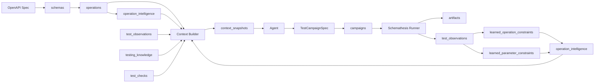
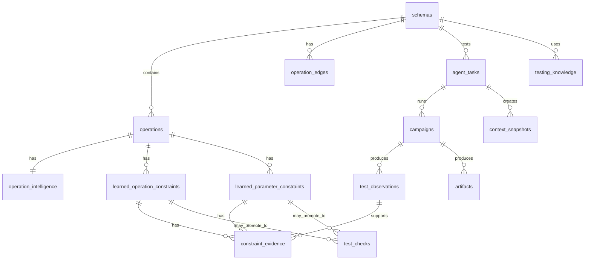
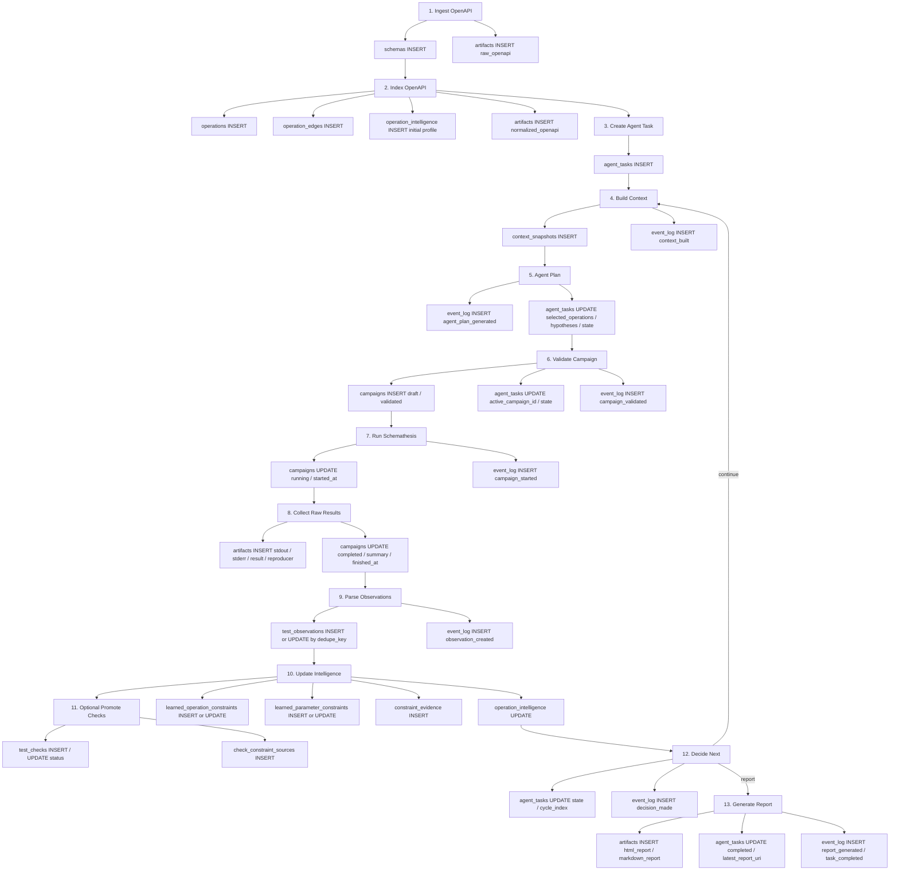

# Agentic API Tester 数据库设计书

## 1. 设计目标

本数据库用于支撑一个基于 **Schemathesis + MCP + Agent + LangGraph** 的 REST/OpenAPI 自动化测试系统。

系统目标不是重写 Schemathesis，而是在 Schemathesis 外部增加：

- OpenAPI operation catalog
- 测试任务状态机
- 测试执行记录
- 测试异常观察
- 动态测试画像
- 学到的 operation / 参数约束
- Agent context snapshot
- 可执行 checks
- 审计与 replay 能力

核心原则：

>  数据库保存事实；
>  Test Intelligence 保存从事实中学习出的测试画像；
>  Context Snapshot 保存某次 Agent 看到了什么；
>  Agent 不直接写数据库，只输出结构化意图；
>  Controller / Service 层校验后提交数据库变更。

---

## 2. 核心术语

| 术语                 | 含义                                                                         |
| ------------------ | -------------------------------------------------------------------------- |
| Spec Data          | OpenAPI 原始与规范化信息                                                           |
| Operation Catalog  | 从 OpenAPI 编译出的 API operation 目录                                            |
| Campaign           | 一轮 Schemathesis 测试执行                                                       |
| Test Observation   | 测试执行中观察到的异常、失败、疑似问题或证据                                                     |
| Test Intelligence  | 从历史 campaign / observation 中沉淀出的动态测试画像和策略信号                                |
| Learned Constraint | 系统学习到的 operation 级或参数级约束                                                   |
| Test Check         | 已经验证、可执行或待验证的检查规则                                                          |
| Context Snapshot   | 某次 Agent 调用前看到的上下文快照                                                       |
| Artifact           | 大体积产物引用，例如日志、reproducer、原始结果文件                                             |
| Agent Intent       | Agent 输出的结构化意图，例如 `TestCampaignSpec`、`AnalysisResult`、`DecisionGateOutput` |

---

## 3. 总体数据流



主循环：

```text
OpenAPI
→ Operation Catalog
→ Context Snapshot
→ Agent Intent
→ Campaign
→ Schemathesis Result
→ Test Observation
→ Test Intelligence
→ 下一轮 Context
```

---

## 4. 数据库分层

|数据层|主要表|说明|
|---|---|---|
|Spec Data| `schemas` |OpenAPI 原始与规范化信息|
|Operation Catalog Data| `operations`, `operation_edges` |API operation 静态目录与依赖图|
|Target Config Data| `target_envs`, `auth_profiles` |被测环境与认证配置|
|Task State Data| `agent_tasks` |Agentic 测试任务状态|
|Campaign Data| `campaigns` |单轮 Schemathesis 测试计划与结果摘要|
|Artifact Metadata| `artifacts` |原始日志、reproducer、报告、大对象 URI|
|Observation Data| `test_observations`, `observation_events` |测试观察到的异常证据|
|Intelligence Data| `operation_intelligence`, `learned_operation_constraints`, `learned_parameter_constraints`, `constraint_evidence` |动态测试画像与学到的约束|
|Knowledge & Check Data| `testing_knowledge`, `test_checks`, `check_constraint_sources` |测试知识与可执行 checks|
|Context Snapshot Data| `context_snapshots` |Agent 每次看到的上下文|
|Audit Data| `event_log` |审计、回放、状态变化日志|

---

## 5. 表分级

### 5.1 MVP 必须实现

```text
schemas
operations
operation_intelligence
agent_tasks
campaigns
test_observations
artifacts
context_snapshots
event_log
```

### 5.2 智能增强阶段实现

```text
operation_edges
learned_operation_constraints
learned_parameter_constraints
constraint_evidence
test_checks
testing_knowledge
```

### 5.3 生产化阶段实现

```text
target_envs
auth_profiles
observation_events
failure_patterns
learned_test_values
check_constraint_sources
```

---

## 6. 表关系总图



---

# 7. 表设计

## 7.1 `schemas`

保存 OpenAPI 文档元信息。

```sql
CREATE TABLE schemas (
  id TEXT PRIMARY KEY,
  name TEXT NOT NULL,
  version TEXT,

  spec_hash TEXT NOT NULL,
  raw_spec_uri TEXT NOT NULL,
  normalized_spec_uri TEXT,

  openapi_version TEXT,
  operation_count INTEGER DEFAULT 0,

  created_at TIMESTAMPTZ DEFAULT now()
);

CREATE UNIQUE INDEX idx_schemas_hash
ON schemas(spec_hash);
```

说明：

```text
schemas = 这个 OpenAPI 是什么
```

边界：

- 不保存动态测试结果。
- 不直接保存完整 OpenAPI 内容。
- 完整 OpenAPI 文件放对象存储，数据库只保存 URI。

---

## 7.2 `operations`

保存从 OpenAPI 编译出的 operation catalog。

```sql
CREATE TABLE operations (
  id TEXT PRIMARY KEY,
  schema_id TEXT NOT NULL REFERENCES schemas(id),

  operation_id TEXT,
  method TEXT NOT NULL,
  path TEXT NOT NULL,
  tags TEXT[],

  summary TEXT,
  resource TEXT,
  mutability TEXT,

  security JSONB,

  request_schema_refs TEXT[],
  response_schema_refs TEXT[],

  card_json JSONB NOT NULL,

  static_risk_score NUMERIC DEFAULT 0,

  created_at TIMESTAMPTZ DEFAULT now()
);

CREATE INDEX idx_operations_schema
ON operations(schema_id);

CREATE INDEX idx_operations_method_path
ON operations(schema_id, method, path);

CREATE INDEX idx_operations_tags
ON operations USING GIN(tags);

CREATE INDEX idx_operations_card_json
ON operations USING GIN(card_json);

CREATE INDEX idx_operations_static_risk
ON operations(schema_id, static_risk_score DESC);
```

说明：

```text
operations = API 静态目录，来自 OpenAPI。
```

边界：

- 不存历史失败。
    
- 不存学习结果。
    
- 不存 Agent 判断。
    
- 动态画像放 `operation_intelligence`。
    

---

## 7.3 `operation_edges`

保存 operation 之间的结构关系。

```sql
CREATE TABLE operation_edges (
  id BIGSERIAL PRIMARY KEY,
  schema_id TEXT NOT NULL REFERENCES schemas(id),

  source_operation_id TEXT NOT NULL REFERENCES operations(id),
  target_operation_id TEXT NOT NULL REFERENCES operations(id),

  edge_type TEXT NOT NULL,
  confidence NUMERIC NOT NULL,

  mapping_json JSONB,

  created_at TIMESTAMPTZ DEFAULT now()
);

CREATE INDEX idx_operation_edges_source
ON operation_edges(schema_id, source_operation_id);

CREATE INDEX idx_operation_edges_target
ON operation_edges(schema_id, target_operation_id);
```

`edge_type` 示例：

```text
create_to_get
create_to_update
create_to_delete
response_id_to_path_param
location_header
openapi_link
heuristic_resource_lifecycle
```

---

## 7.4 `target_envs`

保存测试目标环境。

```sql
CREATE TABLE target_envs (
  id TEXT PRIMARY KEY,
  name TEXT NOT NULL,

  base_url TEXT NOT NULL,
  environment_type TEXT NOT NULL,

  allow_write BOOLEAN DEFAULT false,
  allow_delete BOOLEAN DEFAULT false,

  rate_limit_json JSONB,
  network_policy_json JSONB,

  created_at TIMESTAMPTZ DEFAULT now()
);
```

边界：

- Agent 不允许修改。
    
- 是否允许写操作、删除操作应由配置或人工决定。
    

---

## 7.5 `auth_profiles`

保存认证配置引用。

```sql
CREATE TABLE auth_profiles (
  id TEXT PRIMARY KEY,
  target_env_id TEXT NOT NULL REFERENCES target_envs(id),

  name TEXT NOT NULL,
  auth_type TEXT NOT NULL,

  secret_ref TEXT NOT NULL,
  scopes TEXT[],

  created_at TIMESTAMPTZ DEFAULT now()
);
```

边界：

- 只保存 `secret_ref`。
    
- 不保存明文 token、cookie、password、Authorization header。
    

---

## 7.6 `agent_tasks`

保存一次完整 Agentic API testing 任务的状态。

```sql
CREATE TABLE agent_tasks (
  id TEXT PRIMARY KEY,

  schema_id TEXT NOT NULL REFERENCES schemas(id),
  target_env_id TEXT,

  state TEXT NOT NULL,

  goal_json JSONB NOT NULL,
  budget_json JSONB NOT NULL,

  cycle_index INTEGER DEFAULT 0,

  active_campaign_id TEXT,

  selected_operation_ids TEXT[] DEFAULT '{}',
  current_hypotheses TEXT[] DEFAULT '{}',
  current_check_ids TEXT[] DEFAULT '{}',

  context_snapshot_id TEXT,
  latest_report_uri TEXT,

  blockers_json JSONB DEFAULT '[]',
  last_error TEXT,

  version INTEGER DEFAULT 0,

  created_at TIMESTAMPTZ DEFAULT now(),
  updated_at TIMESTAMPTZ DEFAULT now()
);

CREATE INDEX idx_agent_tasks_schema
ON agent_tasks(schema_id);

CREATE INDEX idx_agent_tasks_state
ON agent_tasks(state);
```

推荐状态：

```text
new
indexing
ready
planning
validating_plan
preparing
running
analyzing
updating_intelligence
deciding
reporting
completed
failed
paused
cancelled
```

并发控制建议使用乐观锁：

```sql
UPDATE agent_tasks
SET state = $new_state,
    version = version + 1,
    updated_at = now()
WHERE id = $task_id
  AND state = $expected_state
  AND version = $expected_version;
```

边界：

- Agent 不直接更新 `agent_tasks.state`。
    
- 状态迁移由 Task Controller 控制。
    

---

## 7.7 `campaigns`

保存一轮 Schemathesis 测试执行。

```sql
CREATE TABLE campaigns (
  id TEXT PRIMARY KEY,

  task_id TEXT NOT NULL REFERENCES agent_tasks(id),
  schema_id TEXT NOT NULL REFERENCES schemas(id),
  target_env_id TEXT,

  status TEXT NOT NULL,
  campaign_type TEXT NOT NULL,

  campaign_spec_json JSONB NOT NULL,
  validation_result_json JSONB,
  summary_json JSONB,

  started_at TIMESTAMPTZ,
  finished_at TIMESTAMPTZ,

  artifact_bundle_uri TEXT,

  created_at TIMESTAMPTZ DEFAULT now()
);

CREATE INDEX idx_campaigns_task
ON campaigns(task_id);

CREATE INDEX idx_campaigns_schema_status
ON campaigns(schema_id, status);

CREATE INDEX idx_campaigns_type
ON campaigns(schema_id, campaign_type);
```

`campaign_type` 示例：

```text
smoke
broad_contract
risk_targeted_fuzzing
stateful_workflow
regression_retest
check_validation
```

`status` 示例：

```text
draft
validated
queued
running
completed
failed
timed_out
cancelled
paused_for_approval
```

边界：

```text
campaigns = 跑了什么
test_observations = 发现了什么
operation_intelligence = 学到了什么
```

---

## 7.8 `artifacts`

保存大体积产物 metadata 和 URI。

```sql
CREATE TABLE artifacts (
  id TEXT PRIMARY KEY,

  task_id TEXT,
  campaign_id TEXT,
  observation_id TEXT,

  artifact_type TEXT NOT NULL,
  artifact_uri TEXT NOT NULL,

  content_hash TEXT,
  size_bytes BIGINT,

  metadata_json JSONB,

  created_at TIMESTAMPTZ DEFAULT now()
);

CREATE INDEX idx_artifacts_task
ON artifacts(task_id);

CREATE INDEX idx_artifacts_campaign
ON artifacts(campaign_id);

CREATE INDEX idx_artifacts_observation
ON artifacts(observation_id);

CREATE INDEX idx_artifacts_type
ON artifacts(artifact_type);
```

`artifact_type` 示例：

```text
raw_openapi
normalized_openapi
schemathesis_stdout
schemathesis_stderr
schemathesis_json_result
junit_xml
request_response_log
reproducer
generated_check_module
context_snapshot
html_report
markdown_report
```

边界：

- `artifacts` 只保存 metadata 和 URI。
    
- 不保存业务判断。
    
- 原始日志、完整 request/response、reproducer 不应直接塞进主业务表。
    

---

## 7.9 `test_observations`

保存测试运行中观察到的异常、失败或疑似问题。

```sql
CREATE TABLE test_observations (
  id TEXT PRIMARY KEY,

  task_id TEXT NOT NULL REFERENCES agent_tasks(id),
  campaign_id TEXT NOT NULL REFERENCES campaigns(id),
  schema_id TEXT NOT NULL REFERENCES schemas(id),
  operation_id TEXT REFERENCES operations(id),

  observation_type TEXT NOT NULL,
  status TEXT NOT NULL DEFAULT 'observed',

  severity TEXT NOT NULL,
  confidence NUMERIC DEFAULT 0.5,

  dedupe_key TEXT NOT NULL,

  check_id TEXT,

  request_fingerprint TEXT,
  response_fingerprint TEXT,

  request_summary_json JSONB,
  response_summary_json JSONB,

  reproducer_artifact_id TEXT,
  raw_artifact_id TEXT,

  hypothesis TEXT,

  first_seen_at TIMESTAMPTZ DEFAULT now(),
  last_seen_at TIMESTAMPTZ DEFAULT now(),
  occurrence_count INTEGER DEFAULT 1
);

CREATE UNIQUE INDEX idx_test_observations_dedupe
ON test_observations(schema_id, dedupe_key);

CREATE INDEX idx_test_observations_operation
ON test_observations(schema_id, operation_id);

CREATE INDEX idx_test_observations_type
ON test_observations(schema_id, observation_type);

CREATE INDEX idx_test_observations_status
ON test_observations(schema_id, status);
```

`observation_type` 示例：

```text
server_error
status_code_conformance
response_schema_conformance
content_type_conformance
negative_data_acceptance
positive_data_rejection
auth_bypass_suspect
permission_bypass_suspect
tenant_isolation_suspect
stateful_invariant_violation
business_invariant_violation
custom_check_violation
runner_error
flake_suspect
```

`status` 示例：

```text
observed
normalized
deduplicated
triaging
confirmed_issue
false_positive
flaky
environment_issue
spec_issue
ignored
resolved
regressed
```

边界：

```text
test_observations = 测试看到了什么异常证据。
```

它不是长期策略，也不是动态画像。

---

## 7.10 `observation_events`

可选表。用于保存同一个 observation 的每次具体发生记录。

```sql
CREATE TABLE observation_events (
  id TEXT PRIMARY KEY,

  observation_id TEXT NOT NULL REFERENCES test_observations(id),
  campaign_id TEXT NOT NULL REFERENCES campaigns(id),

  request_fingerprint TEXT,
  response_fingerprint TEXT,

  request_summary_json JSONB,
  response_summary_json JSONB,

  artifact_id TEXT REFERENCES artifacts(id),

  observed_at TIMESTAMPTZ DEFAULT now()
);

CREATE INDEX idx_observation_events_observation
ON observation_events(observation_id);

CREATE INDEX idx_observation_events_campaign
ON observation_events(campaign_id);
```

区别：

```text
test_observations = 去重后的异常对象
observation_events = 每次具体出现记录
```

MVP 可以暂时不建。

---

## 7.11 `operation_intelligence`

保存每个 operation 的动态测试画像。

```sql
CREATE TABLE operation_intelligence (
  operation_id TEXT PRIMARY KEY REFERENCES operations(id),
  schema_id TEXT NOT NULL REFERENCES schemas(id),

  test_state TEXT NOT NULL DEFAULT 'profiled',

  dynamic_risk_score NUMERIC DEFAULT 0,
  failure_density NUMERIC DEFAULT 0,
  flake_rate NUMERIC DEFAULT 0,

  last_tested_at TIMESTAMPTZ,

  total_campaigns INTEGER DEFAULT 0,
  total_cases_executed INTEGER DEFAULT 0,

  observation_count INTEGER DEFAULT 0,
  confirmed_issue_count INTEGER DEFAULT 0,

  server_error_count INTEGER DEFAULT 0,
  contract_violation_count INTEGER DEFAULT 0,
  semantic_violation_count INTEGER DEFAULT 0,
  flake_count INTEGER DEFAULT 0,

  learned_constraint_count INTEGER DEFAULT 0,
  high_confidence_constraint_count INTEGER DEFAULT 0,

  recommended_checks TEXT[] DEFAULT '{}',
  regression_priority NUMERIC DEFAULT 0,

  summary_json JSONB DEFAULT '{}',

  updated_at TIMESTAMPTZ DEFAULT now()
);

CREATE INDEX idx_operation_intelligence_schema_risk
ON operation_intelligence(schema_id, dynamic_risk_score DESC);

CREATE INDEX idx_operation_intelligence_regression
ON operation_intelligence(schema_id, regression_priority DESC);

CREATE INDEX idx_operation_intelligence_state
ON operation_intelligence(schema_id, test_state);
```

说明：

```text
operation_intelligence = operation 的动态测试画像。
```

更新来源：

- campaign result
    
- test observations
    
- learned constraints
    
- check 命中情况
    
- regression 结果
    

---

## 7.12 `learned_operation_constraints`

保存 operation / workflow / lifecycle 级约束。

```sql
CREATE TABLE learned_operation_constraints (
  id TEXT PRIMARY KEY,

  schema_id TEXT NOT NULL REFERENCES schemas(id),
  operation_id TEXT NOT NULL REFERENCES operations(id),

  constraint_type TEXT NOT NULL,
  constraint_scope TEXT NOT NULL DEFAULT 'operation',

  expression_json JSONB NOT NULL,

  status TEXT NOT NULL DEFAULT 'candidate',
  confidence NUMERIC NOT NULL DEFAULT 0.5,

  source_type TEXT NOT NULL DEFAULT 'learned',

  learned_from_campaign_id TEXT REFERENCES campaigns(id),
  promoted_check_id TEXT,

  first_seen_at TIMESTAMPTZ DEFAULT now(),
  last_seen_at TIMESTAMPTZ DEFAULT now(),
  updated_at TIMESTAMPTZ DEFAULT now()
);

CREATE INDEX idx_learned_op_constraints_operation
ON learned_operation_constraints(schema_id, operation_id);

CREATE INDEX idx_learned_op_constraints_status
ON learned_operation_constraints(schema_id, status);

CREATE INDEX idx_learned_op_constraints_type
ON learned_operation_constraints(schema_id, constraint_type);
```

`constraint_type` 示例：

```text
auth_required
create_then_get_available
delete_then_get_not_found
get_idempotent
state_transition_allowed
response_contains_resource_id
unsupported_method_rejected
resource_lifecycle
```

约束状态：

```text
candidate
supported
validated
promoted_to_check
rejected
low_confidence
conflicting
deprecated
```

---

## 7.13 `learned_parameter_constraints`

保存参数、request body 字段、response body 字段级约束。

```sql
CREATE TABLE learned_parameter_constraints (
  id TEXT PRIMARY KEY,

  schema_id TEXT NOT NULL REFERENCES schemas(id),
  operation_id TEXT NOT NULL REFERENCES operations(id),

  location TEXT NOT NULL,
  parameter_name TEXT,
  json_path TEXT,

  constraint_type TEXT NOT NULL,
  expression_json JSONB NOT NULL,

  status TEXT NOT NULL DEFAULT 'candidate',
  confidence NUMERIC NOT NULL DEFAULT 0.5,

  source_type TEXT NOT NULL DEFAULT 'learned',

  learned_from_campaign_id TEXT REFERENCES campaigns(id),
  promoted_check_id TEXT,

  first_seen_at TIMESTAMPTZ DEFAULT now(),
  last_seen_at TIMESTAMPTZ DEFAULT now(),
  updated_at TIMESTAMPTZ DEFAULT now()
);

CREATE INDEX idx_learned_param_constraints_operation
ON learned_parameter_constraints(schema_id, operation_id);

CREATE INDEX idx_learned_param_constraints_location
ON learned_parameter_constraints(schema_id, location);

CREATE INDEX idx_learned_param_constraints_status
ON learned_parameter_constraints(schema_id, status);

CREATE INDEX idx_learned_param_constraints_type
ON learned_parameter_constraints(schema_id, constraint_type);
```

`location` 示例：

```text
path
query
header
cookie
request_body
response_body
```

`constraint_type` 示例：

```text
numeric_min
numeric_max
numeric_range
enum_values
string_pattern
string_format
required_when_success
mutual_exclusion
dependency
ordering
non_empty
unique_items
field_relation
```

示例：

```json
{
  "operation_id": "op_create_invoice",
  "location": "request_body",
  "json_path": "$.amount",
  "constraint_type": "numeric_min",
  "expression_json": {
    "operator": ">=",
    "value": 0
  },
  "status": "candidate",
  "confidence": 0.84
}
```

---

## 7.14 `constraint_evidence`

连接 learned constraint 和支撑它的 observation / campaign / artifact。

```sql
CREATE TABLE constraint_evidence (
  id TEXT PRIMARY KEY,

  constraint_kind TEXT NOT NULL,
  constraint_id TEXT NOT NULL,

  observation_id TEXT REFERENCES test_observations(id),
  campaign_id TEXT REFERENCES campaigns(id),
  artifact_id TEXT REFERENCES artifacts(id),

  evidence_type TEXT NOT NULL,
  evidence_summary_json JSONB,

  support_score NUMERIC DEFAULT 0.5,

  created_at TIMESTAMPTZ DEFAULT now()
);

CREATE INDEX idx_constraint_evidence_constraint
ON constraint_evidence(constraint_kind, constraint_id);

CREATE INDEX idx_constraint_evidence_observation
ON constraint_evidence(observation_id);
```

`constraint_kind`：

```text
operation
parameter
```

`evidence_type`：

```text
failure_case
successful_case
boundary_case
repeated_observation
manual_confirmation
spec_hint
agent_hypothesis
```

边界：

```text
learned constraint 必须能追溯到 evidence。
```

---

## 7.15 `testing_knowledge`

保存通用 REST/API 测试知识。

```sql
CREATE TABLE testing_knowledge (
  id TEXT PRIMARY KEY,

  title TEXT NOT NULL,
  category TEXT NOT NULL,
  content TEXT NOT NULL,

  applies_to_json JSONB,
  confidence NUMERIC DEFAULT 0.8,

  source TEXT,

  created_at TIMESTAMPTZ DEFAULT now(),
  updated_at TIMESTAMPTZ DEFAULT now()
);

CREATE INDEX idx_testing_knowledge_category
ON testing_knowledge(category);
```

`category` 示例：

```text
rest_semantics
pagination
auth_testing
stateful_testing
idempotency
security
business_invariant
schemathesis_usage
```

边界：

- 不保存某次 campaign 的结果。
    
- 不保存具体 observation。
    
- Agent 提议的长期知识必须经过验证后才能写入。
    

---

## 7.16 `test_checks`

保存可执行或待验证的 checks。

```sql
CREATE TABLE test_checks (
  id TEXT PRIMARY KEY,

  schema_id TEXT REFERENCES schemas(id),

  name TEXT NOT NULL,
  template TEXT NOT NULL,

  check_spec_json JSONB NOT NULL,

  status TEXT NOT NULL,
  severity TEXT,
  confidence NUMERIC,

  evidence_json JSONB,

  generated_code_artifact_id TEXT,

  created_by TEXT NOT NULL DEFAULT 'agent',

  created_at TIMESTAMPTZ DEFAULT now(),
  updated_at TIMESTAMPTZ DEFAULT now()
);

CREATE INDEX idx_test_checks_schema_status
ON test_checks(schema_id, status);

CREATE INDEX idx_test_checks_template
ON test_checks(template);
```

`status`：

```text
proposed
compiled
static_validated
dry_run_validated
enabled
disabled
rejected
flaky
```

边界：

```text
learned constraint 不是 executable check。
只有经过 compile / static validation / dry run 后，才能成为 enabled check。
```

---

## 7.17 `check_constraint_sources`

记录 test_check 来源于哪些 learned constraints。

```sql
CREATE TABLE check_constraint_sources (
  check_id TEXT NOT NULL REFERENCES test_checks(id),

  constraint_kind TEXT NOT NULL,
  constraint_id TEXT NOT NULL,

  created_at TIMESTAMPTZ DEFAULT now(),

  PRIMARY KEY (check_id, constraint_kind, constraint_id)
);
```

---

## 7.18 `context_snapshots`

保存每次 Agent 调用时看到的上下文快照 metadata。

```sql
CREATE TABLE context_snapshots (
  id TEXT PRIMARY KEY,

  task_id TEXT NOT NULL REFERENCES agent_tasks(id),
  schema_id TEXT NOT NULL REFERENCES schemas(id),

  role TEXT NOT NULL,
  cycle_index INTEGER NOT NULL,

  artifact_uri TEXT NOT NULL,

  source_refs_json JSONB,
  total_estimated_tokens INTEGER,

  prompt_version TEXT NOT NULL,
  model_name TEXT NOT NULL,

  created_at TIMESTAMPTZ DEFAULT now()
);

CREATE INDEX idx_context_snapshots_task
ON context_snapshots(task_id, cycle_index);

CREATE INDEX idx_context_snapshots_role
ON context_snapshots(schema_id, role);
```

`role` 示例：

```text
planner
check_designer
result_analyst
decision_maker
intelligence_updater
```

边界：

- 建议只 `INSERT`，不 `UPDATE`。
    
- Context snapshot 是某次 Agent 输入记录，不是长期记忆本身。
    

---

## 7.19 `event_log`

保存系统审计、状态变化、工具调用与 replay 信息。

```sql
CREATE TABLE event_log (
  id BIGSERIAL PRIMARY KEY,

  task_id TEXT,
  campaign_id TEXT,

  event_type TEXT NOT NULL,
  actor TEXT NOT NULL,

  from_state TEXT,
  to_state TEXT,

  payload_json JSONB NOT NULL,

  created_at TIMESTAMPTZ DEFAULT now()
);

CREATE INDEX idx_event_log_task
ON event_log(task_id, created_at);

CREATE INDEX idx_event_log_campaign
ON event_log(campaign_id, created_at);

CREATE INDEX idx_event_log_type
ON event_log(event_type, created_at);
```

`actor` 示例：

```text
user
agent
controller
mcp_server
runner
system
```

`event_type` 示例：

```text
schema_ingested
operation_indexed
task_created
context_built
agent_plan_generated
campaign_validated
approval_requested
campaign_started
campaign_finished
observation_created
intelligence_updated
check_promoted
report_generated
task_completed
task_failed
```

边界：

```text
event_log append-only，不 update，不 delete。
```

---

# 8. 每张表什么时候更新

## 8.1 更新总时序



---

## 8.2 更新矩阵

|阶段|schemas|operations|operation_intelligence|agent_tasks|campaigns|artifacts|test_observations|learned constraints|test_checks|context_snapshots|event_log|
|---|--:|--:|--:|--:|--:|--:|--:|--:|--:|--:|--:|
|Ingest OpenAPI|I|-|-|-|-|I|-|-|-|-|I|
|Index OpenAPI|R|I|I|-|-|I|-|-|-|-|I|
|Create Task|R|R|R|I|-|-|-|-|-|-|I|
|Build Context|R|R|R|R|R|I|R|R|R|I|I|
|Agent Plan|-|R|R|U|-|-|-|-|-|-|I|
|Validate Campaign|-|R|R|U|I/U|-|-|-|R|-|I|
|Run Campaign|-|R|-|U|U|-|-|-|R|-|I|
|Collect Result|-|-|-|-|U|I|-|-|-|-|I|
|Parse Observations|-|R|-|-|R|R|I/U|-|R|-|I|
|Update Intelligence|-|R|U|-|R|R|R|I/U|-|-|I|
|Promote Checks|-|R|R|-|-|I|R|R|I/U|-|I|
|Decide Next|-|R|R|U|R|-|R|R|R|-|I|
|Generate Report|-|R|R|U|R|I|R|R|R|-|I|

说明：

```text
I = INSERT
U = UPDATE
R = READ only
- = 不参与
```

---

# 9. 模块写入边界

|模块|允许更新的表|
|---|---|
|OpenAPI Ingest Service| `schemas`, `artifacts`, `event_log` |
|OpenAPI Indexer| `operations`, `operation_edges`, `operation_intelligence`, `artifacts`, `event_log` |
|Config Service| `target_envs`, `auth_profiles`, `event_log` |
|Task Controller| `agent_tasks`, `event_log` |
|Context Builder| `context_snapshots`, `artifacts`, `event_log` |
|Agent|不直接更新任何业务表|
|Campaign Controller| `campaigns`, `agent_tasks`, `event_log` |
|Runner| `campaigns`, `artifacts`, `event_log` |
|Result Parser|解析 raw result，本身不做长期智能判断|
|ObservationService| `test_observations`, `observation_events`, `event_log` |
|IntelligenceService| `operation_intelligence`, `learned_operation_constraints`, `learned_parameter_constraints`, `constraint_evidence`, `event_log` |
|Check Registry / Compiler| `test_checks`, `check_constraint_sources`, `artifacts`, `event_log` |
|Report Service| `artifacts`, `agent_tasks`, `event_log` |

---

# 10. Agent 写入限制

Agent 不允许直接写数据库。

Agent 只能输出结构化对象：

```text
TestCampaignSpec
CheckSpec
AnalysisResult
IntelligenceDelta
DecisionGateOutput
```

这些对象必须经过：

```text
Validator
Controller
ObservationService
IntelligenceService
CheckRegistry
```

校验后才能写库。

禁止行为：

```text
Agent 直接 INSERT test_observations
Agent 直接 UPDATE operation_intelligence
Agent 直接 UPDATE agent_tasks.state
Agent 直接启用 test_checks
Agent 直接修改 target_envs 或 auth_profiles
Agent 直接写 testing_knowledge
```

---

# 11. 容易混淆的数据边界

## 11.1 `operations` vs `operation_intelligence`

|表|含义|来源|
|---|---|---|
| `operations` |API 静态目录|OpenAPI|
| `operation_intelligence` |operation 动态测试画像|历史测试结果|

例子：

```text
operations:
  POST /v1/invoices 有 amount 字段。

operation_intelligence:
  amount 字段历史上经常触发 500，建议重点测 -1、0、极大值。
```

---

## 11.2 `test_observations` vs `operation_intelligence`

|表|含义|粒度|
|---|---|---|
| `test_observations` |测试看到了什么异常证据|单个异常 / 去重后的失败|
| `operation_intelligence` |系统从异常中学到了什么|operation 级动态画像|

例子：

```text
test_observations:
  amount=-1 导致 500。

operation_intelligence:
  createInvoice 的 dynamic_risk_score 提高。
```

---

## 11.3 `learned_constraints` vs `test_checks`

|表|含义|是否可执行|
|---|---|---|
| `learned_operation_constraints` / `learned_parameter_constraints` |学到的约束|不一定|
| `test_checks` |可执行或待验证的检查规则|是|

流程：

```text
Observation
→ Learned Constraint
→ Validate / Dry Run
→ Test Check
→ Schemathesis Custom Check
```

---

## 11.4 `context_snapshots` vs `operation_intelligence`

|表|含义|生命周期|
|---|---|---|
| `context_snapshots` |某次 Agent 看到的输入|单次调用|
| `operation_intelligence` |系统长期学到的测试画像|长期存在|

---

# 12. MVP 简化版

MVP 可以先实现：

```text
schemas
operations
operation_intelligence
agent_tasks
campaigns
test_observations
artifacts
context_snapshots
event_log
```

MVP 阶段可以暂时不实现：

```text
operation_edges
target_envs
auth_profiles
learned_operation_constraints
learned_parameter_constraints
constraint_evidence
testing_knowledge
test_checks
check_constraint_sources
observation_events
```

但概念上仍然要区分：

```text
Operation Catalog
Test Observation
Test Intelligence
Context Snapshot
Campaign
Artifact
```

---

# 13. 推荐实现顺序

```text
1. 定义 Pydantic domain models
   OperationCard
   TestCampaignSpec
   CampaignResult
   TestObservation
   OperationIntelligence
   ContextPackage

2. 建 MVP 数据库表
   schemas
   operations
   operation_intelligence
   agent_tasks
   campaigns
   test_observations
   artifacts
   context_snapshots
   event_log

3. 实现 OpenAPI Ingest + Indexer
   OpenAPI → schemas / operations / operation_intelligence

4. 实现 Schemathesis Runner
   campaign_spec → Schemathesis run → artifacts / campaigns

5. 实现 ObservationService
   raw result → test_observations

6. 实现 IntelligenceService
   test_observations → operation_intelligence

7. 实现 ContextBuilder
   operations + operation_intelligence + observations → context_snapshots

8. 实现 Planner Agent
   context_snapshot → TestCampaignSpec

9. 实现 LangGraph Loop
   build_context → plan → validate → run → parse → update_intelligence → decide

10. 再加入 Learned Constraints 和 Test Checks
```

---

# 14. 最终设计结论

本数据库设计围绕以下主线：

```text
OpenAPI
→ Operation Catalog
→ Campaign
→ Test Observation
→ Test Intelligence
→ Context Snapshot
→ Agent Intent
→ Campaign
```

各层职责：

```text
Operation Catalog 描述 API 是什么；
Campaign 记录系统实际跑了什么；
Test Observation 记录测试看到了什么；
Test Intelligence 记录系统学到了什么；
Context Snapshot 记录 Agent 当时看到了什么；
Test Check 记录哪些规则可以执行；
Artifact 记录证据文件在哪里；
Event Log 记录系统发生了什么。
```

最重要的边界：

```text
Agent 不直接写数据库；
Observation 是证据；
Intelligence 是归纳；
Context 是本次输入；
Check 是可执行规则；
Artifact 是大对象引用。
```