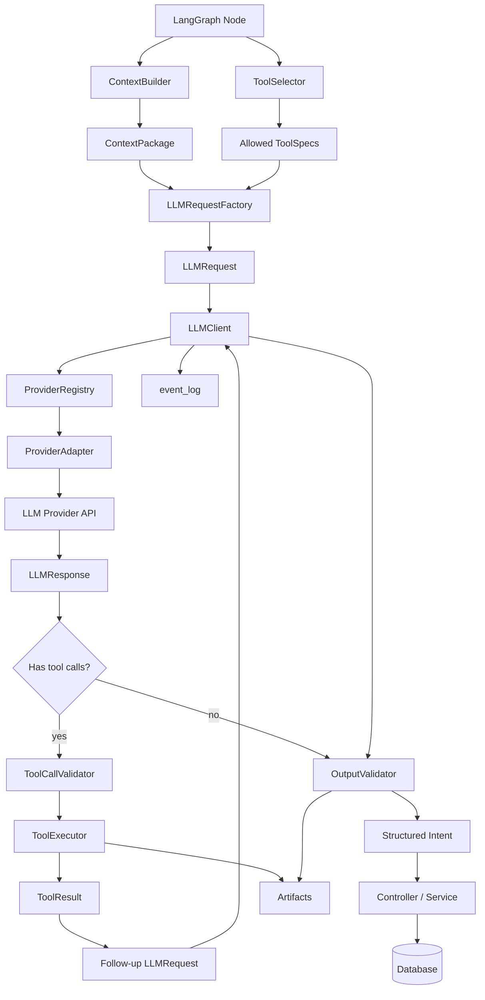

# Agentic API Tester LLM 模块设计书

> **Historical design:** This document records an early, broader LLM design and
> is not the current runtime contract. In particular, the production
> `FakeProvider`, `LLMRequestFactory`, placeholder async provider interface, and
> client retry branch were removed during the approved safe-slimming work. See
> [`docs/tasks/llm-safe-slimming.md`](tasks/llm-safe-slimming.md) for the active
> decision and verification record.
>
> The `ContextPackage`, policy registry, source-ref, persistence, and request
> factory sections below are also historical. The current message-construction
> contract is the four-name `restscope.context` facade documented in
> [`docs/tasks/project-agent-context.md`](tasks/project-agent-context.md).
>
> The global ToolRegistry, ToolSelector, ToolPolicy, ToolCallValidator, and
> ToolExecutor sections are historical as well. The former Agent-owned Tool
> definition decision was also superseded. The active architecture is the
> global Catalog, Profile-authorized generic Agent, and deterministic Harness
> recorded in
> [`docs/adr/0001-main-agent-skills-tools-harness.md`](adr/0001-main-agent-skills-tools-harness.md).

## 1. 设计目标

LLM 模块用于为 Agentic API Tester 提供统一的大模型调用能力。

本模块需要支持：

```text
1. 封装不同 LLM Provider。
2. 支持 OpenAI-compatible / Anthropic / FakeProvider。
3. 支持结构化输出。
4. 支持 tool use / function call。
5. 支持 MCP tool 接入。
6. 支持 Skill 注册与注入。
7. 支持 LangGraph Node 调用。
8. 支持输出校验、审计、replay。
```

本模块不直接负责：

```text
1. Memory 检索。
2. Context 构造。
3. Schemathesis 执行。
4. MCP 工具直接暴露给模型执行。
5. 数据库业务表写入。
6. task 状态迁移。
7. observation 写入。
8. operation_intelligence 更新。
```

一句话目标：

```text
LLM 模块负责把 ContextPackage 转换成经过工具约束和输出校验的结构化 Agent Intent。
```

---

## 2. 系统定位

完整主链路：

```text
Database
→ Repository
→ MemoryService
→ MemoryPackage
→ ContextBuilder
→ ContextPackage
→ LLMRequestFactory
→ LLMClient
→ ProviderAdapter
→ LLMResponse
→ ToolExecutor / OutputValidator
→ Structured Intent
→ Controller / Service
→ Database
```

在 LangGraph 中：

```text
LangGraph Node
→ ContextBuilder.build(...)
→ ToolSelector.select_for_role(...)
→ LLMRequestFactory.from_context(...)
→ LLMClient.invoke(...)
→ ToolCallValidator / ToolExecutor
→ OutputValidator.validate(...)
→ Node returns Partial[AgentState]
```

---

## 3. 核心原则

```text
1. Provider 不感知 LangGraph。
2. Provider 不感知数据库。
3. Provider 不直接执行工具。
4. Provider 只负责 provider API 适配。
5. ToolExecutor 才负责执行工具。
6. MCP 只是工具来源，不直接暴露给模型绕过策略。
7. Skill 是能力包，不等于工具执行权限。
8. OutputValidator 负责结构化输出校验。
9. Controller / Service 负责业务写库。
10. LangGraph state 必须轻量、可序列化。
```

重要边界：

```text
LLM 可以建议动作；
ToolExecutor 可以执行被允许的工具；
Controller / Service 才能修改业务状态。
```

---

## 4. 模块总架构



---

## 5. 推荐目录结构

```text
src/agentic_api_tester/
├── llm/
│   ├── __init__.py
│   ├── schemas.py
│   ├── exceptions.py
│   ├── config.py
│   ├── model_selector.py
│   ├── request_factory.py
│   ├── client.py
│   ├── registry.py
│   ├── response_parser.py
│   ├── invocation_recorder.py
│   ├── redactor.py
│   │
│   └── providers/
│       ├── __init__.py
│       ├── base.py
│       ├── fake.py
│       ├── openai_compatible.py
│       └── anthropic.py
│
├── capabilities/
│   ├── __init__.py
│   ├── schemas.py
│   ├── tool_registry.py
│   ├── tool_selector.py
│   ├── tool_policy.py
│   ├── tool_call_validator.py
│   ├── tool_executor.py
│   ├── tool_result_serializer.py
│   │
│   ├── local_tools/
│   │   ├── artifact_tools.py
│   │   ├── openapi_tools.py
│   │   ├── observation_tools.py
│   │   └── schemathesis_tools.py
│   │
│   ├── mcp/
│   │   ├── mcp_client.py
│   │   ├── mcp_server_registry.py
│   │   └── mcp_tool_adapter.py
│   │
│   └── skills/
│       ├── skill_manifest.py
│       ├── skill_registry.py
│       ├── skill_loader.py
│       └── skill_policy.py
│
├── validation/
│   ├── output_validator.py
│   └── semantic_validators.py
│
└── graph/
    ├── state.py
    ├── routes.py
    └── nodes/
        ├── planner_node.py
        ├── result_analyst_node.py
        └── decision_maker_node.py
```

MVP 简化版：

```text
llm/
├── schemas.py
├── exceptions.py
├── config.py
├── model_selector.py
├── request_factory.py
├── client.py
├── registry.py
└── providers/
    ├── base.py
    ├── fake.py
    └── openai_compatible.py

capabilities/
├── schemas.py
├── tool_registry.py
├── tool_selector.py
├── tool_policy.py
├── tool_call_validator.py
└── tool_executor.py
```

---

## 6. 模块边界

## 6.1 LLM 模块负责

```text
1. 定义统一 LLMMessage / LLMRequest / LLMResponse。
2. 定义 Provider 接口。
3. 管理 ProviderRegistry。
4. 按 role 选择模型配置。
5. 从 ContextPackage 构造 LLMRequest。
6. 把 ToolSpec 转成 provider tool schema。
7. 把 provider tool call 转成统一 ToolCall。
8. 返回统一 LLMResponse。
9. 记录 token usage / latency / finish_reason。
```

## 6.2 LLM 模块不负责

```text
1. 不查询数据库业务表。
2. 不构造 ContextPackage。
3. 不选择 Memory。
4. 不执行 Schemathesis。
5. 不直接调用 MCP server。
6. 不直接执行 skill 脚本。
7. 不直接写 campaigns。
8. 不直接写 test_observations。
9. 不直接更新 operation_intelligence。
10. 不直接修改 agent_tasks.state。
```

---

## 7. 核心对象设计

文件：

```text
src/agentic_api_tester/llm/schemas.py
```

## 7.1 `LLMProviderName`

```python
from typing import Literal

LLMProviderName = Literal[
    "fake",
    "openai_compatible",
    "anthropic",
]
```

---

## 7.2 `LLMMessage`

```python
from typing import Literal
from pydantic import BaseModel


class LLMMessage(BaseModel):
    role: Literal["system", "user", "assistant", "tool"]
    content: str

    tool_call_id: str | None = None
    name: str | None = None
```

说明：

```text
system / user / assistant 用于普通模型消息。
tool 用于把 ToolResult 返回给模型。
```

---

## 7.3 `LLMResponseFormat`

```python
from typing import Literal

LLMResponseFormat = Literal[
    "text",
    "json",
    "json_schema",
]
```

---

## 7.4 `ToolKind`

```python
from typing import Literal

ToolKind = Literal[
    "local_function",
    "mcp_tool",
    "skill",
    "provider_builtin",
]
```

---

## 7.5 `ToolSpec`

```python
from typing import Any, Literal
from pydantic import BaseModel, Field


class ToolSpec(BaseModel):
    name: str
    description: str

    kind: ToolKind

    input_schema: dict[str, Any]
    output_schema: dict[str, Any] | None = None

    risk_level: Literal["low", "medium", "high"] = "low"

    read_only: bool = True
    requires_approval: bool = False

    timeout_seconds: int = 30

    metadata: dict[str, Any] = Field(default_factory=dict)
```

设计说明：

```text
ToolSpec 是所有工具来源的统一表示。
本地函数、MCP tool、Skill 暴露能力，都必须先转换成 ToolSpec。
```

---

## 7.6 `ToolCall`

```python
from typing import Any
from pydantic import BaseModel, Field


class ToolCall(BaseModel):
    id: str
    name: str
    arguments: dict[str, Any] = Field(default_factory=dict)

    provider: str | None = None
    raw: dict[str, Any] | None = None
```

---

## 7.7 `ToolResult`

```python
from typing import Any, Literal
from pydantic import BaseModel, Field


class ToolResult(BaseModel):
    tool_call_id: str
    name: str

    status: Literal[
        "succeeded",
        "failed",
        "denied",
        "timed_out",
        "approval_required",
    ]

    content: str | None = None
    structured: dict[str, Any] | None = None

    error: dict[str, Any] | None = None

    artifact_ids: list[str] = Field(default_factory=list)

    metadata: dict[str, Any] = Field(default_factory=dict)
```

---

## 7.8 `LLMRequest`

```python
from typing import Any, Literal
from pydantic import BaseModel, Field


class LLMRequest(BaseModel):
    provider: str
    model: str

    messages: list[LLMMessage]

    temperature: float = 0.0
    max_tokens: int = 2048

    response_format: LLMResponseFormat = "text"
    json_schema: dict[str, Any] | None = None
    json_schema_name: str | None = None

    tools: list[ToolSpec] = Field(default_factory=list)
    tool_choice: Literal["none", "auto", "required"] | str = "none"

    timeout_seconds: int = 60

    metadata: dict[str, Any] = Field(default_factory=dict)
```

`metadata` 示例：

```json
{
  "task_id": "task_001",
  "schema_id": "schema_001",
  "role": "planner",
  "context_id": "ctx_001",
  "context_snapshot_id": "ctxs_001",
  "prompt_version": "planner_v1"
}
```

---

## 7.9 `LLMResponse`

```python
from typing import Any
from pydantic import BaseModel, Field


class LLMResponse(BaseModel):
    provider: str
    model: str

    content: str | None = None
    parsed_json: dict[str, Any] | None = None

    tool_calls: list[ToolCall] = Field(default_factory=list)

    input_tokens: int | None = None
    output_tokens: int | None = None
    total_tokens: int | None = None

    finish_reason: str | None = None
    provider_request_id: str | None = None

    latency_ms: int | None = None

    metadata: dict[str, Any] = Field(default_factory=dict)
```

重要约束：

```text
LLMResponse 必须可 JSON 序列化。
不要把 provider SDK 原始对象放进 LLMResponse。
raw response 如需保留，应写 artifact。
```

---

## 7.10 `LLMModelConfig`

```python
from pydantic import BaseModel


class LLMModelConfig(BaseModel):
    role: str

    provider: str
    model: str

    temperature: float = 0.0
    max_tokens: int = 2048
    timeout_seconds: int = 60

    response_format: LLMResponseFormat = "json_schema"

    tool_choice: str = "none"

    enabled: bool = True
```

---

## 8. Provider 抽象

文件：

```text
src/agentic_api_tester/llm/providers/base.py
```

```python
from abc import ABC, abstractmethod

from agentic_api_tester.llm.schemas import LLMRequest, LLMResponse


class BaseLLMProvider(ABC):
    provider_name: str

    @abstractmethod
    def invoke(self, request: LLMRequest) -> LLMResponse:
        raise NotImplementedError

    async def ainvoke(self, request: LLMRequest) -> LLMResponse:
        raise NotImplementedError(
            f"{self.provider_name} does not implement async invoke."
        )
```

Provider 职责：

```text
1. 把 LLMRequest 转成 provider API request。
2. 把 ToolSpec 转成 provider tool schema。
3. 调用 provider API。
4. 把 provider response 转成 LLMResponse。
5. 把 provider tool call 转成 ToolCall。
```

Provider 禁止：

```text
1. 不执行 ToolCall。
2. 不调用 MCP server。
3. 不写数据库。
4. 不修改 LangGraph state。
5. 不做业务语义校验。
```

---

## 9. FakeProvider

文件：

```text
src/agentic_api_tester/llm/providers/fake.py
```

```python
import json
import time
from uuid import uuid4

from agentic_api_tester.llm.providers.base import BaseLLMProvider
from agentic_api_tester.llm.schemas import LLMRequest, LLMResponse, ToolCall


class FakeProvider(BaseLLMProvider):
    provider_name = "fake"

    def invoke(self, request: LLMRequest) -> LLMResponse:
        started = time.perf_counter()

        if request.tools and request.tool_choice in {"auto", "required"}:
            tool = request.tools[0]
            return LLMResponse(
                provider=self.provider_name,
                model=request.model,
                content=None,
                tool_calls=[
                    ToolCall(
                        id=f"fake_tool_call_{uuid4().hex}",
                        name=tool.name,
                        arguments={},
                        provider=self.provider_name,
                    )
                ],
                finish_reason="tool_calls",
                latency_ms=int((time.perf_counter() - started) * 1000),
                metadata={"fake": True},
            )

        payload = self._build_payload(request)
        content = json.dumps(payload, ensure_ascii=False)

        return LLMResponse(
            provider=self.provider_name,
            model=request.model,
            content=content,
            parsed_json=payload,
            input_tokens=0,
            output_tokens=0,
            total_tokens=0,
            finish_reason="stop",
            latency_ms=int((time.perf_counter() - started) * 1000),
            metadata={"fake": True},
        )

    def _build_payload(self, request: LLMRequest) -> dict:
        schema_name = request.json_schema_name or ""

        if schema_name == "TestCampaignSpec":
            return {
                "campaign_type": "risk_targeted_fuzzing",
                "target_operation_ids": [],
                "hypothesis": "Fake planner hypothesis.",
                "rationale": "Fake provider generated this response for local testing.",
                "schemathesis_config": {
                    "checks": [
                        "not_a_server_error",
                        "status_code_conformance",
                        "response_schema_conformance"
                    ],
                    "max_examples": 100
                },
                "expected_learning": [
                    "Validate LLM provider integration."
                ],
                "stop_conditions": [
                    "max_examples reached",
                    "campaign timeout reached"
                ],
                "notes": []
            }

        if schema_name == "AnalysisResult":
            return {
                "campaign_id": request.metadata.get("campaign_id", "fake_campaign"),
                "summary": "Fake analysis result.",
                "campaign_quality": "valid",
                "observations": [],
                "recommended_next_actions": []
            }

        if schema_name == "DecisionGateOutput":
            return {
                "next_action": "continue_testing",
                "rationale": "Fake decision for local testing.",
                "priority_operation_ids": [],
                "required_follow_up": [],
                "budget_assessment": "Budget is available.",
                "blockers": []
            }

        return {
            "message": "fake response",
            "model": request.model
        }
```

---

## 10. OpenAI-compatible Provider

文件：

```text
src/agentic_api_tester/llm/providers/openai_compatible.py
```

```python
import json
import time
from typing import Any

from openai import OpenAI

from agentic_api_tester.llm.providers.base import BaseLLMProvider
from agentic_api_tester.llm.schemas import LLMRequest, LLMResponse, ToolCall, ToolSpec


class OpenAICompatibleProvider(BaseLLMProvider):
    provider_name = "openai_compatible"

    def __init__(
        self,
        *,
        api_key: str,
        base_url: str | None = None,
    ):
        self.client = OpenAI(
            api_key=api_key,
            base_url=base_url,
        )

    def invoke(self, request: LLMRequest) -> LLMResponse:
        started = time.perf_counter()

        kwargs: dict[str, Any] = {
            "model": request.model,
            "messages": self._convert_messages(request),
            "temperature": request.temperature,
            "max_tokens": request.max_tokens,
            "timeout": request.timeout_seconds,
        }

        if request.response_format == "json":
            kwargs["response_format"] = {"type": "json_object"}

        if request.response_format == "json_schema":
            if not request.json_schema:
                raise ValueError(
                    "json_schema is required when response_format=json_schema"
                )

            kwargs["response_format"] = {
                "type": "json_schema",
                "json_schema": {
                    "name": request.json_schema_name or "structured_output",
                    "schema": request.json_schema,
                    "strict": True,
                },
            }

        if request.tools:
            kwargs["tools"] = self._convert_tools(request.tools)
            kwargs["tool_choice"] = request.tool_choice

        response = self.client.chat.completions.create(**kwargs)

        latency_ms = int((time.perf_counter() - started) * 1000)

        choice = response.choices[0]
        message = choice.message
        content = message.content or None

        parsed_json = None
        if content and request.response_format in {"json", "json_schema"}:
            try:
                parsed_json = json.loads(content)
            except json.JSONDecodeError:
                parsed_json = None

        usage = getattr(response, "usage", None)

        return LLMResponse(
            provider=self.provider_name,
            model=request.model,
            content=content,
            parsed_json=parsed_json,
            tool_calls=self._extract_tool_calls(message),
            input_tokens=getattr(usage, "prompt_tokens", None),
            output_tokens=getattr(usage, "completion_tokens", None),
            total_tokens=getattr(usage, "total_tokens", None),
            finish_reason=getattr(choice, "finish_reason", None),
            provider_request_id=getattr(response, "id", None),
            latency_ms=latency_ms,
            metadata={
                "response_format": request.response_format,
            },
        )

    def _convert_messages(self, request: LLMRequest) -> list[dict]:
        messages = []

        for message in request.messages:
            item = {
                "role": message.role,
                "content": message.content,
            }

            if message.role == "tool":
                item["tool_call_id"] = message.tool_call_id

            if message.name:
                item["name"] = message.name

            messages.append(item)

        return messages

    def _convert_tools(self, tools: list[ToolSpec]) -> list[dict]:
        converted = []

        for tool in tools:
            if tool.kind in {"local_function", "mcp_tool"}:
                converted.append(
                    {
                        "type": "function",
                        "function": {
                            "name": tool.name,
                            "description": tool.description,
                            "parameters": tool.input_schema,
                        },
                    }
                )

        return converted

    def _extract_tool_calls(self, message) -> list[ToolCall]:
        result = []

        for raw_call in getattr(message, "tool_calls", []) or []:
            args = {}

            try:
                args = json.loads(raw_call.function.arguments or "{}")
            except json.JSONDecodeError:
                args = {}

            result.append(
                ToolCall(
                    id=raw_call.id,
                    name=raw_call.function.name,
                    arguments=args,
                    provider=self.provider_name,
                    raw={
                        "id": raw_call.id,
                        "type": raw_call.type,
                    },
                )
            )

        return result
```

---

## 11. Anthropic Provider

AnthropicProvider 后置实现。MVP 不依赖。

文件：

```text
src/agentic_api_tester/llm/providers/anthropic.py
```

设计要求：

```text
1. Anthropic system message 单独映射。
2. 普通 messages 转为 Anthropic messages。
3. tool schema 转为 Anthropic tools。
4. tool_use block 转成 ToolCall。
5. tool_result 转成对应 message。
6. 返回统一 LLMResponse。
```

---

## 12. Provider Registry

文件：

```text
src/agentic_api_tester/llm/registry.py
```

```python
from agentic_api_tester.llm.exceptions import UnknownProviderError
from agentic_api_tester.llm.providers.base import BaseLLMProvider


class LLMProviderRegistry:
    def __init__(self):
        self._providers: dict[str, BaseLLMProvider] = {}

    def register(self, provider: BaseLLMProvider) -> None:
        self._providers[provider.provider_name] = provider

    def get(self, provider_name: str) -> BaseLLMProvider:
        provider = self._providers.get(provider_name)

        if provider is None:
            raise UnknownProviderError(
                f"Unknown LLM provider: {provider_name}"
            )

        return provider

    def list_provider_names(self) -> list[str]:
        return sorted(self._providers.keys())
```

---

## 13. LLMClient

文件：

```text
src/agentic_api_tester/llm/client.py
```

```python
from agentic_api_tester.llm.registry import LLMProviderRegistry
from agentic_api_tester.llm.schemas import LLMRequest, LLMResponse


class LLMClient:
    def __init__(self, registry: LLMProviderRegistry):
        self.registry = registry

    def invoke(self, request: LLMRequest) -> LLMResponse:
        provider = self.registry.get(request.provider)
        return provider.invoke(request)

    async def ainvoke(self, request: LLMRequest) -> LLMResponse:
        provider = self.registry.get(request.provider)
        return await provider.ainvoke(request)
```

约束：

```text
1. LLMClient 不 import LangGraph。
2. LLMClient 不 import database repository。
3. LLMClient 不执行工具。
4. LLMClient 不做业务输出校验。
```

---

## 14. ModelSelector

文件：

```text
src/agentic_api_tester/llm/model_selector.py
```

```python
from agentic_api_tester.llm.schemas import LLMModelConfig


class ModelSelector:
    def __init__(self, config: dict):
        self.config = config

    def select(self, role: str) -> LLMModelConfig:
        models = self.config["llm"]["models"]

        if role not in models:
            raise ValueError(f"No LLM model config found for role: {role}")

        raw = models[role]

        return LLMModelConfig(
            role=role,
            provider=raw["provider"],
            model=raw["model"],
            temperature=raw.get("temperature", 0.0),
            max_tokens=raw.get("max_tokens", 2048),
            timeout_seconds=raw.get("timeout_seconds", 60),
            response_format=raw.get("response_format", "json_schema"),
            tool_choice=raw.get("tool_choice", "none"),
            enabled=raw.get("enabled", True),
        )
```

推荐 role 映射：

| Role                   | 模型能力       | 是否启用 tools |
| ---------------------- | ---------- | ---------: |
| `planner`              | 中高推理       |         可选 |
| `result_analyst`       | 高上下文 + 推理  |         可选 |
| `decision_maker`       | 中等推理       |      通常不启用 |
| `check_designer`       | 高推理 + 代码能力 |         可选 |
| `intelligence_updater` | 中高推理       |         后置 |

---

## 15. LLMRequestFactory

文件：

```text
src/agentic_api_tester/llm/request_factory.py
```

```python
from typing import Any

from agentic_api_tester.llm.schemas import (
    LLMMessage,
    LLMRequest,
    LLMModelConfig,
    ToolSpec,
)


class LLMRequestFactory:
    def from_context(
        self,
        *,
        context_package,
        model_config: LLMModelConfig,
        output_model: Any | None = None,
        tools: list[ToolSpec] | None = None,
        tool_choice: str | None = None,
    ) -> LLMRequest:
        json_schema = None
        json_schema_name = None

        if model_config.response_format == "json_schema":
            if output_model is None:
                raise ValueError(
                    "output_model is required for json_schema response format"
                )

            json_schema = output_model.model_json_schema()
            json_schema_name = output_model.__name__

        return LLMRequest(
            provider=model_config.provider,
            model=model_config.model,
            messages=[
                LLMMessage(
                    role=message.role,
                    content=message.content,
                )
                for message in context_package.messages
            ],
            temperature=model_config.temperature,
            max_tokens=model_config.max_tokens,
            timeout_seconds=model_config.timeout_seconds,
            response_format=model_config.response_format,
            json_schema=json_schema,
            json_schema_name=json_schema_name,
            tools=tools or [],
            tool_choice=tool_choice or model_config.tool_choice,
            metadata={
                "task_id": context_package.task_id,
                "schema_id": context_package.schema_id,
                "role": context_package.role,
                "context_id": context_package.id,
                "context_snapshot_id": context_package.metadata.get(
                    "context_snapshot_id"
                ),
                "prompt_version": context_package.prompt_version,
            },
        )

    def with_tool_results(
        self,
        *,
        original_request: LLMRequest,
        original_response,
        tool_results,
    ) -> LLMRequest:
        messages = list(original_request.messages)

        if original_response.content:
            messages.append(
                LLMMessage(
                    role="assistant",
                    content=original_response.content,
                )
            )

        for result in tool_results:
            messages.append(
                LLMMessage(
                    role="tool",
                    tool_call_id=result.tool_call_id,
                    name=result.name,
                    content=result.content or str(result.structured or result.error),
                )
            )

        return original_request.model_copy(
            update={
                "messages": messages,
                "tool_choice": "none",
            }
        )
```

---

## 16. 配置设计

文件：

```text
config/llm.yaml
```

```yaml
llm:
  default_provider: openai_compatible

  providers:
    fake:
      enabled: true

    openai_compatible:
      enabled: true
      api_key_env: OPENAI_API_KEY
      base_url_env: OPENAI_BASE_URL

    anthropic:
      enabled: false
      api_key_env: ANTHROPIC_API_KEY

  models:
    planner:
      provider: openai_compatible
      model: gpt-4.1
      temperature: 0.0
      max_tokens: 2048
      timeout_seconds: 60
      response_format: json_schema
      tool_choice: auto

    result_analyst:
      provider: openai_compatible
      model: gpt-4.1
      temperature: 0.0
      max_tokens: 4096
      timeout_seconds: 60
      response_format: json_schema
      tool_choice: auto

    decision_maker:
      provider: openai_compatible
      model: gpt-4.1-mini
      temperature: 0.0
      max_tokens: 2048
      timeout_seconds: 60
      response_format: json_schema
      tool_choice: none

    local_fake:
      provider: fake
      model: fake-model
      temperature: 0.0
      max_tokens: 2048
      timeout_seconds: 5
      response_format: json_schema
      tool_choice: none
```

---

## 17. Provider 初始化

文件：

```text
src/agentic_api_tester/llm/config.py
```

```python
import os

from agentic_api_tester.llm.registry import LLMProviderRegistry
from agentic_api_tester.llm.providers.fake import FakeProvider
from agentic_api_tester.llm.providers.openai_compatible import OpenAICompatibleProvider


def build_llm_registry(config: dict) -> LLMProviderRegistry:
    registry = LLMProviderRegistry()
    providers = config["llm"]["providers"]

    fake_config = providers.get("fake", {})
    if fake_config.get("enabled", False):
        registry.register(FakeProvider())

    openai_config = providers.get("openai_compatible", {})
    if openai_config.get("enabled", False):
        api_key_env = openai_config.get("api_key_env", "OPENAI_API_KEY")
        base_url_env = openai_config.get("base_url_env", "OPENAI_BASE_URL")

        api_key = os.getenv(api_key_env)
        base_url = os.getenv(base_url_env)

        if not api_key:
            raise RuntimeError(
                f"Missing API key environment variable: {api_key_env}"
            )

        registry.register(
            OpenAICompatibleProvider(
                api_key=api_key,
                base_url=base_url,
            )
        )

    return registry
```

---

# 18. Capability / Tool Runtime 设计

LLM Provider 只返回 tool call，不执行工具。

工具执行由 `capabilities/` 模块负责。

---

## 18.1 ToolRegistry

文件：

```text
src/agentic_api_tester/capabilities/tool_registry.py
```

```python
from agentic_api_tester.llm.schemas import ToolSpec


class ToolRegistry:
    def __init__(self):
        self._tools: dict[str, ToolSpec] = {}
        self._handlers: dict[str, callable] = {}

    def register(
        self,
        *,
        spec: ToolSpec,
        handler: callable,
    ) -> None:
        self._tools[spec.name] = spec
        self._handlers[spec.name] = handler

    def get_spec(self, name: str) -> ToolSpec:
        return self._tools[name]

    def get_handler(self, name: str):
        return self._handlers[name]

    def list_specs(self) -> list[ToolSpec]:
        return list(self._tools.values())
```

---

## 18.2 ToolSelector

文件：

```text
src/agentic_api_tester/capabilities/tool_selector.py
```

```python
class ToolSelector:
    def __init__(self, registry):
        self.registry = registry

    def select_for_role(
        self,
        *,
        role: str,
        state: dict,
    ):
        all_tools = self.registry.list_specs()

        if role == "planner":
            return [
                tool for tool in all_tools
                if tool.name in {
                    "artifact.read_summary",
                    "openapi.lookup_operation",
                    "schemathesis.validate_campaign_spec",
                }
            ]

        if role == "result_analyst":
            return [
                tool for tool in all_tools
                if tool.name in {
                    "artifact.read_summary",
                    "observation.lookup_recent",
                    "schemathesis.parse_result_summary",
                }
            ]

        if role == "decision_maker":
            return [
                tool for tool in all_tools
                if tool.read_only
            ]

        return []
```

---

## 18.3 ToolPolicy

文件：

```text
src/agentic_api_tester/capabilities/tool_policy.py
```

```python
class ToolPolicy:
    def is_allowed(
        self,
        *,
        role: str,
        tool_spec,
        state: dict,
    ) -> bool:
        if tool_spec.requires_approval:
            return False

        if role == "planner":
            return tool_spec.name in {
                "artifact.read_summary",
                "openapi.lookup_operation",
                "schemathesis.validate_campaign_spec",
            }

        if role == "result_analyst":
            return tool_spec.name in {
                "artifact.read_summary",
                "observation.lookup_recent",
                "schemathesis.parse_result_summary",
            }

        if role == "decision_maker":
            return tool_spec.read_only

        return False
```

MVP 策略：

```text
1. 默认禁止工具。
2. role 显式允许工具。
3. high risk 工具默认 requires_approval。
4. read_only 工具可自动执行。
5. write / run / delete / shell 工具不自动执行。
6. 工具结果必须摘要化。
7. 完整结果写 artifact。
```

---

## 18.4 ToolCallValidator

文件：

```text
src/agentic_api_tester/capabilities/tool_call_validator.py
```

```python
class ToolCallValidator:
    def __init__(self, registry, policy):
        self.registry = registry
        self.policy = policy

    def validate(
        self,
        *,
        tool_call,
        role: str,
        state: dict,
    ) -> list[dict]:
        errors = []

        try:
            spec = self.registry.get_spec(tool_call.name)
        except KeyError:
            return [
                {
                    "type": "unknown_tool",
                    "message": f"Unknown tool: {tool_call.name}",
                }
            ]

        if not self.policy.is_allowed(
            role=role,
            tool_spec=spec,
            state=state,
        ):
            errors.append(
                {
                    "type": "tool_not_allowed",
                    "message": f"Tool not allowed for role {role}: {tool_call.name}",
                }
            )

        if spec.requires_approval:
            errors.append(
                {
                    "type": "approval_required",
                    "message": f"Tool requires approval: {tool_call.name}",
                }
            )

        return errors
```

---

## 18.5 ToolExecutor

文件：

```text
src/agentic_api_tester/capabilities/tool_executor.py
```

```python
from agentic_api_tester.llm.schemas import ToolResult


class ToolExecutor:
    def __init__(
        self,
        registry,
        validator,
        artifact_service=None,
    ):
        self.registry = registry
        self.validator = validator
        self.artifact_service = artifact_service

    def execute(
        self,
        *,
        tool_call,
        role: str,
        state: dict,
    ) -> ToolResult:
        errors = self.validator.validate(
            tool_call=tool_call,
            role=role,
            state=state,
        )

        if errors:
            return ToolResult(
                tool_call_id=tool_call.id,
                name=tool_call.name,
                status="denied",
                error={
                    "errors": errors,
                },
            )

        spec = self.registry.get_spec(tool_call.name)
        handler = self.registry.get_handler(tool_call.name)

        try:
            result = handler(**tool_call.arguments)
        except TimeoutError as exc:
            return ToolResult(
                tool_call_id=tool_call.id,
                name=tool_call.name,
                status="timed_out",
                error={
                    "message": str(exc),
                },
            )
        except Exception as exc:
            return ToolResult(
                tool_call_id=tool_call.id,
                name=tool_call.name,
                status="failed",
                error={
                    "type": type(exc).__name__,
                    "message": str(exc),
                },
            )

        return ToolResult(
            tool_call_id=tool_call.id,
            name=tool_call.name,
            status="succeeded",
            content=result.get("content"),
            structured=result.get("structured"),
            artifact_ids=result.get("artifact_ids", []),
            metadata={
                "risk_level": spec.risk_level,
                "read_only": spec.read_only,
            },
        )
```

---

# 19. 推荐本地工具

## 19.1 `artifact.read_summary`

```python
artifact_read_summary_spec = ToolSpec(
    name="artifact.read_summary",
    description="Read a short summarized view of an artifact.",
    kind="local_function",
    input_schema={
        "type": "object",
        "properties": {
            "artifact_id": {"type": "string"}
        },
        "required": ["artifact_id"]
    },
    risk_level="low",
    read_only=True,
    requires_approval=False,
)
```

---

## 19.2 `openapi.lookup_operation`

```python
openapi_lookup_operation_spec = ToolSpec(
    name="openapi.lookup_operation",
    description="Look up a summarized operation card by operation_id.",
    kind="local_function",
    input_schema={
        "type": "object",
        "properties": {
            "operation_id": {"type": "string"}
        },
        "required": ["operation_id"]
    },
    risk_level="low",
    read_only=True,
    requires_approval=False,
)
```

---

## 19.3 `observation.lookup_recent`

```python
observation_lookup_recent_spec = ToolSpec(
    name="observation.lookup_recent",
    description="Read recent observation summaries for an operation.",
    kind="local_function",
    input_schema={
        "type": "object",
        "properties": {
            "operation_id": {"type": "string"},
            "limit": {"type": "integer", "default": 5}
        },
        "required": ["operation_id"]
    },
    risk_level="low",
    read_only=True,
    requires_approval=False,
)
```

---

## 19.4 `schemathesis.validate_campaign_spec`

```python
validate_campaign_spec_tool = ToolSpec(
    name="schemathesis.validate_campaign_spec",
    description="Validate whether a TestCampaignSpec can be mapped to runner configuration.",
    kind="local_function",
    input_schema={
        "type": "object",
        "properties": {
            "campaign_spec": {"type": "object"}
        },
        "required": ["campaign_spec"]
    },
    risk_level="low",
    read_only=True,
    requires_approval=False,
)
```

---

## 19.5 第一版不建议暴露的工具

```text
1. schemathesis.run_campaign
2. db.execute_sql
3. test_observation.insert
4. operation_intelligence.update
5. file.write_anywhere
6. shell.run
7. http.request_arbitrary
8. mcp.call_untrusted_remote_tool
```

原因：

```text
这些动作会改变系统状态或扩大攻击面；
应由 Controller / Service / Runner 控制，不由模型 tool call 直接执行。
```

---

# 20. MCP 接入设计

MCP 不直接暴露给 Provider。MCP server 的 tools 需要先转换成统一 `ToolSpec`。

```text
MCP server tools/list
→ MCPClient
→ MCPToolAdapter
→ ToolSpec
→ ToolRegistry
→ ToolSelector
→ LLMRequest.tools
```

---

## 20.1 MCPClient

文件：

```text
src/agentic_api_tester/capabilities/mcp/mcp_client.py
```

```python
class MCPClient:
    def __init__(self, server_config):
        self.server_config = server_config

    async def list_tools(self) -> list[dict]:
        ...

    async def call_tool(
        self,
        *,
        name: str,
        arguments: dict,
    ) -> dict:
        ...
```

---

## 20.2 MCPToolAdapter

文件：

```text
src/agentic_api_tester/capabilities/mcp/mcp_tool_adapter.py
```

```python
from agentic_api_tester.llm.schemas import ToolSpec


class MCPToolAdapter:
    def to_tool_spec(
        self,
        *,
        server_name: str,
        mcp_tool: dict,
    ) -> ToolSpec:
        return ToolSpec(
            name=f"mcp.{server_name}.{mcp_tool['name']}",
            description=mcp_tool.get("description", ""),
            kind="mcp_tool",
            input_schema=mcp_tool["inputSchema"],
            risk_level=self._infer_risk_level(mcp_tool),
            read_only=self._infer_read_only(mcp_tool),
            requires_approval=not self._infer_read_only(mcp_tool),
            metadata={
                "server_name": server_name,
                "mcp_tool_name": mcp_tool["name"],
            },
        )

    def _infer_read_only(self, mcp_tool: dict) -> bool:
        name = mcp_tool.get("name", "").lower()
        description = mcp_tool.get("description", "").lower()

        write_keywords = [
            "write",
            "delete",
            "update",
            "insert",
            "execute",
            "run",
            "send",
            "create",
        ]

        return not any(
            keyword in name or keyword in description
            for keyword in write_keywords
        )

    def _infer_risk_level(self, mcp_tool: dict) -> str:
        if self._infer_read_only(mcp_tool):
            return "low"

        return "medium"
```

---

## 20.3 MCP Tool Handler

```python
class MCPToolHandler:
    def __init__(
        self,
        *,
        mcp_client: MCPClient,
        server_name: str,
        tool_name: str,
    ):
        self.mcp_client = mcp_client
        self.server_name = server_name
        self.tool_name = tool_name

    async def __call__(self, **arguments):
        result = await self.mcp_client.call_tool(
            name=self.tool_name,
            arguments=arguments,
        )

        return {
            "content": self._summarize_result(result),
            "structured": result,
            "artifact_ids": [],
        }

    def _summarize_result(self, result: dict) -> str:
        return str(result)[:2000]
```

---

## 20.4 MCP 安全策略

```text
1. MCP server 必须在 allowlist 中。
2. 每个 MCP tool 必须转换成 ToolSpec。
3. MCP tool 默认至少 medium risk。
4. MCP write tool 默认 requires_approval=true。
5. MCP 原始结果写 artifact。
6. MCP 返回给模型的内容必须摘要化。
7. 不允许从用户输入动态拼接 MCP server command。
8. 不允许把所有 MCP tools 无差别暴露给所有 role。
```

---

# 21. Skill 接入设计

Skill 不等于 Tool。

```text
Tool:
  可调用函数，有 input schema，有执行结果。

MCP:
  外部工具协议，用来发现和调用 tools/resources/prompts。

Skill:
  可复用 instruction / workflow / script / template bundle。
```

---

## 21.1 SkillManifest

文件：

```text
src/agentic_api_tester/capabilities/skills/skill_manifest.py
```

```python
from pydantic import BaseModel, Field


class SkillManifest(BaseModel):
    name: str
    description: str

    version: str | None = None

    entrypoint: str | None = None

    allowed_roles: list[str] = Field(default_factory=list)

    required_tools: list[str] = Field(default_factory=list)

    risk_level: str = "low"

    instruction_artifact_uri: str | None = None

    metadata: dict = Field(default_factory=dict)
```

---

## 21.2 SkillRegistry

```python
class SkillRegistry:
    def __init__(self):
        self._skills: dict[str, SkillManifest] = {}

    def register(self, skill: SkillManifest) -> None:
        self._skills[skill.name] = skill

    def get(self, name: str) -> SkillManifest:
        return self._skills[name]

    def select_for_role(self, role: str) -> list[SkillManifest]:
        return [
            skill
            for skill in self._skills.values()
            if role in skill.allowed_roles
        ]
```

---

## 21.3 Skill 使用方式

MVP 阶段只建议把 Skill 用作：

```text
1. prompt guidance
2. check template
3. tool usage instruction
4. MCP server scaffold instruction
5. testing strategy knowledge
```

不建议第一版允许：

```text
1. skill 直接执行 shell。
2. skill 任意读写文件。
3. skill 任意发网络请求。
4. skill 获取 secret。
5. skill 动态安装依赖。
```

---

## 21.4 SkillPolicy

```python
class SkillPolicy:
    def is_allowed(
        self,
        *,
        skill,
        role: str,
        state: dict,
    ) -> bool:
        if role not in skill.allowed_roles:
            return False

        if skill.risk_level == "high":
            return False

        return True
```

---

# 22. LangGraph 集成设计

## 22.1 AgentState

文件：

```text
src/agentic_api_tester/graph/state.py
```

```python
from typing import Any, TypedDict


class AgentState(TypedDict, total=False):
    task_id: str
    schema_id: str
    cycle_index: int

    active_campaign_id: str | None
    current_operation_ids: list[str]

    context_snapshot_id: str | None

    campaign_spec: dict[str, Any] | None
    analysis_result: dict[str, Any] | None
    decision: dict[str, Any] | None

    last_llm_response: dict[str, Any] | None
    last_tool_results: list[dict[str, Any]]
    last_error: dict[str, Any] | None

    next_action: str | None
```

不允许放入 state：

```text
1. provider SDK 原始 response。
2. 完整 ContextPackage。
3. 完整 Schemathesis 日志。
4. 完整 artifact 内容。
5. secret。
```

推荐放入 state：

```text
1. context_snapshot_id
2. structured intent
3. response 摘要
4. tool result 摘要
5. artifact_id
6. last_error 摘要
```

---

## 22.2 PlannerNode

```python
from agentic_api_tester.context.schemas import ContextBuildRequest
from agentic_api_tester.domain.models import TestCampaignSpec


class PlannerNode:
    def __init__(
        self,
        *,
        context_builder,
        model_selector,
        request_factory,
        tool_selector,
        tool_executor,
        llm_client,
        output_validator,
    ):
        self.context_builder = context_builder
        self.model_selector = model_selector
        self.request_factory = request_factory
        self.tool_selector = tool_selector
        self.tool_executor = tool_executor
        self.llm_client = llm_client
        self.output_validator = output_validator

    def __call__(self, state: dict) -> dict:
        context = self.context_builder.build(
            ContextBuildRequest(
                task_id=state["task_id"],
                schema_id=state["schema_id"],
                role="planner",
            )
        )

        model_config = self.model_selector.select("planner")

        tools = self.tool_selector.select_for_role(
            role="planner",
            state=state,
        )

        request = self.request_factory.from_context(
            context_package=context,
            model_config=model_config,
            output_model=TestCampaignSpec,
            tools=tools,
            tool_choice="auto",
        )

        try:
            response = self.llm_client.invoke(request)
        except Exception as exc:
            return {
                "context_snapshot_id": context.metadata.get("context_snapshot_id"),
                "last_error": {
                    "type": "llm_provider_failed",
                    "message": str(exc),
                    "retryable": False,
                },
                "next_action": "planner_failed",
            }

        tool_results = []

        for tool_call in response.tool_calls:
            tool_result = self.tool_executor.execute(
                tool_call=tool_call,
                role="planner",
                state=state,
            )
            tool_results.append(tool_result)

        if tool_results:
            followup_request = self.request_factory.with_tool_results(
                original_request=request,
                original_response=response,
                tool_results=tool_results,
            )

            response = self.llm_client.invoke(followup_request)

        validation = self.output_validator.validate(
            response=response,
            output_model=TestCampaignSpec,
            context_package=context,
        )

        if not validation.valid:
            return {
                "context_snapshot_id": context.metadata.get("context_snapshot_id"),
                "last_llm_response": response.model_dump(mode="json"),
                "last_tool_results": [
                    result.model_dump(mode="json")
                    for result in tool_results
                ],
                "last_error": {
                    "type": "planner_output_invalid",
                    "errors": [
                        error.model_dump(mode="json")
                        for error in validation.errors
                    ],
                },
                "next_action": "planner_failed",
            }

        return {
            "context_snapshot_id": context.metadata.get("context_snapshot_id"),
            "last_llm_response": response.model_dump(mode="json"),
            "last_tool_results": [
                result.model_dump(mode="json")
                for result in tool_results
            ],
            "campaign_spec": validation.validated_object.model_dump(mode="json"),
            "next_action": "validate_campaign",
        }
```

---

## 22.3 ResultAnalystNode

```python
from agentic_api_tester.context.schemas import ContextBuildRequest
from agentic_api_tester.domain.models import AnalysisResult


class ResultAnalystNode:
    def __init__(
        self,
        *,
        context_builder,
        model_selector,
        request_factory,
        tool_selector,
        tool_executor,
        llm_client,
        output_validator,
    ):
        self.context_builder = context_builder
        self.model_selector = model_selector
        self.request_factory = request_factory
        self.tool_selector = tool_selector
        self.tool_executor = tool_executor
        self.llm_client = llm_client
        self.output_validator = output_validator

    def __call__(self, state: dict) -> dict:
        context = self.context_builder.build(
            ContextBuildRequest(
                task_id=state["task_id"],
                schema_id=state["schema_id"],
                role="result_analyst",
                campaign_id=state["active_campaign_id"],
                operation_ids=state.get("current_operation_ids", []),
            )
        )

        model_config = self.model_selector.select("result_analyst")

        tools = self.tool_selector.select_for_role(
            role="result_analyst",
            state=state,
        )

        request = self.request_factory.from_context(
            context_package=context,
            model_config=model_config,
            output_model=AnalysisResult,
            tools=tools,
            tool_choice="auto",
        )

        response = self.llm_client.invoke(request)

        tool_results = []

        for tool_call in response.tool_calls:
            tool_result = self.tool_executor.execute(
                tool_call=tool_call,
                role="result_analyst",
                state=state,
            )
            tool_results.append(tool_result)

        if tool_results:
            followup_request = self.request_factory.with_tool_results(
                original_request=request,
                original_response=response,
                tool_results=tool_results,
            )
            response = self.llm_client.invoke(followup_request)

        validation = self.output_validator.validate(
            response=response,
            output_model=AnalysisResult,
            context_package=context,
        )

        if not validation.valid:
            return {
                "context_snapshot_id": context.metadata.get("context_snapshot_id"),
                "last_llm_response": response.model_dump(mode="json"),
                "last_tool_results": [
                    result.model_dump(mode="json")
                    for result in tool_results
                ],
                "last_error": {
                    "type": "result_analysis_invalid",
                    "errors": [
                        error.model_dump(mode="json")
                        for error in validation.errors
                    ],
                },
                "next_action": "analysis_failed",
            }

        return {
            "context_snapshot_id": context.metadata.get("context_snapshot_id"),
            "last_llm_response": response.model_dump(mode="json"),
            "last_tool_results": [
                result.model_dump(mode="json")
                for result in tool_results
            ],
            "analysis_result": validation.validated_object.model_dump(mode="json"),
            "next_action": "apply_observations",
        }
```

---

# 23. OutputValidator 对接

LLM 模块不直接做业务语义校验，但提供标准输入给 OutputValidator。

OutputValidator 接口：

```python
class OutputValidator:
    def validate(
        self,
        *,
        response,
        output_model,
        context_package,
    ):
        ...
```

校验顺序：

```text
1. 如果 response.parsed_json 存在，优先使用。
2. 否则尝试 json.loads(response.content)。
3. Pydantic model_validate。
4. role-specific semantic validation。
5. 返回 ValidationResult。
```

语义校验示例：

```text
Planner:
  - operation_id 必须来自 context。
  - campaign_type 必须受支持。
  - 不能声称已经执行测试。
  - 不能直接确认 issue。

ResultAnalyst:
  - campaign_id 必须匹配当前 campaign。
  - dedupe_key 必须存在。
  - observation_type 必须合法。

DecisionMaker:
  - next_action 必须合法。
  - continue_testing 时必须有 priority_operation_ids。
```

---

# 24. Tool 与 Output 的关系

模型可能返回：

```text
1. 普通结构化 JSON。
2. tool_calls。
3. tool_calls 后再次返回结构化 JSON。
```

推荐处理流程：

```text
LLMResponse
→ if tool_calls:
      ToolCallValidator
      ToolExecutor
      ToolResult
      follow-up LLMRequest
      second LLMResponse
→ OutputValidator
→ Structured Intent
```

约束：

```text
1. tool call 不等于最终 intent。
2. tool result 不直接写业务表。
3. 最终业务动作必须来自 validated intent。
4. Controller / Service 才能执行业务写入。
```

---

# 25. 审计与 Artifact

LLM 模块第一版可以只通过上层 recorder 写：

```text
event_log:
  agent_invocation_started
  agent_invocation_succeeded
  agent_invocation_failed
  tool_call_requested
  tool_call_succeeded
  tool_call_denied
  tool_call_failed

artifacts:
  llm_raw_response
  llm_parsed_response
  llm_validation_error
  tool_raw_result
  tool_result_summary
```

LangGraph state 只保存：

```text
1. context_snapshot_id
2. last_llm_response 摘要
3. last_tool_results 摘要
4. structured intent
5. artifact_id
```

---

# 26. 安全与脱敏

## 26.1 不允许发送给 LLM 的内容

```text
1. Authorization header
2. Cookie
3. Set-Cookie
4. password
5. token
6. api_key
7. access_token
8. refresh_token
9. client_secret
10. private key
11. session_id
12. JWT
```

---

## 26.2 Redactor

文件：

```text
src/agentic_api_tester/llm/redactor.py
```

```python
import re


class Redactor:
    SECRET_KEYS = {
        "authorization",
        "cookie",
        "set-cookie",
        "password",
        "passwd",
        "token",
        "api_key",
        "access_token",
        "refresh_token",
        "client_secret",
        "session_id",
        "jwt",
    }

    def redact_text(self, text: str) -> str:
        patterns = [
            r"Bearer\s+[A-Za-z0-9\-\._~\+\/]+=*",
            r"api[_-]?key\s*[:=]\s*[A-Za-z0-9_\-]+",
            r"access_token\s*[:=]\s*[A-Za-z0-9_\-\.]+",
        ]

        result = text

        for pattern in patterns:
            result = re.sub(
                pattern,
                "***REDACTED***",
                result,
                flags=re.IGNORECASE,
            )

        return result
```

---

# 27. 错误与重试策略

文件：

```text
src/agentic_api_tester/llm/exceptions.py
```

```python
class LLMError(Exception):
    pass


class UnknownProviderError(LLMError):
    pass


class ProviderInvokeError(LLMError):
    pass


class ProviderTimeoutError(ProviderInvokeError):
    pass


class ProviderRateLimitError(ProviderInvokeError):
    pass


class ProviderAuthError(ProviderInvokeError):
    pass


class InvalidProviderResponseError(LLMError):
    pass
```

MVP 策略：

```text
1. UnknownProviderError：直接失败。
2. ProviderAuthError：直接失败。
3. ProviderTimeoutError：可 retry 一次。
4. ProviderRateLimitError：可 retry 一次。
5. JSON parse 失败：交给 OutputValidator。
6. tool denied：返回 ToolResult，不抛异常。
```

---

# 28. 测试策略

## 28.1 LLM Provider 测试

```text
given FakeProvider
when invoke with TestCampaignSpec schema
then returns LLMResponse
and parsed_json is not None
and provider == "fake"
```

```text
given OpenAICompatibleProvider
when LLMRequest has tools
then provider request includes converted tools
```

---

## 28.2 Tool Runtime 测试

```text
given role=planner
and tool=artifact.read_summary
when ToolSelector.select_for_role
then tool is returned
```

```text
given role=planner
and tool=schemathesis.run_campaign
when ToolCallValidator.validate
then tool is denied
```

---

## 28.3 MCP 测试

```text
given MCP server returns tools/list
when MCPToolAdapter.to_tool_spec
then ToolSpec contains mcp.server.tool name
and write-like tools require approval
```

---

## 28.4 Skill 测试

```text
given skill allowed_roles contains planner
when SkillRegistry.select_for_role("planner")
then skill is returned
```

```text
given high risk skill
when SkillPolicy.is_allowed
then returns false
```

---

## 28.5 LangGraph Node 测试

```text
given PlannerNode with FakeProvider
when node is called
then returns partial state
and campaign_spec is present
and state is JSON serializable
```

---

## 28.6 State Serialization 测试

```text
given node returns state update
when json.dumps(update)
then serialization succeeds
```

---

# 29. MVP 实现顺序

```text
1. 实现 llm/schemas.py
   - LLMMessage
   - ToolSpec
   - ToolCall
   - ToolResult
   - LLMRequest
   - LLMResponse
   - LLMModelConfig

2. 实现 providers/base.py

3. 实现 providers/fake.py

4. 实现 registry.py

5. 实现 client.py

6. 实现 model_selector.py

7. 实现 request_factory.py

8. 实现 config/llm.yaml

9. 实现 providers/openai_compatible.py

10. 实现 capabilities/tool_registry.py

11. 实现 capabilities/tool_policy.py

12. 实现 capabilities/tool_selector.py

13. 实现 capabilities/tool_call_validator.py

14. 实现 capabilities/tool_executor.py

15. 注册第一批只读 local tools
    - artifact.read_summary
    - openapi.lookup_operation
    - observation.lookup_recent
    - schemathesis.validate_campaign_spec

16. 接入 PlannerNode
    - ContextBuilder
    - ToolSelector
    - LLMRequestFactory
    - LLMClient
    - ToolExecutor
    - OutputValidator

17. 接入 ResultAnalystNode

18. 接入 DecisionMakerNode

19. 增加 MCPClient 和 MCPToolAdapter

20. 增加 SkillRegistry 和 SkillPolicy

21. 写单元测试和集成测试
```

---

# 30. MVP 完成标准

```text
1. FakeProvider 可用。
2. OpenAICompatibleProvider 可用。
3. LLMClient.invoke() 是上层唯一模型调用入口。
4. Provider 不 import LangGraph。
5. Provider 不执行工具。
6. Provider 不写数据库。
7. ToolSpec / ToolCall / ToolResult 可用。
8. ToolSelector 能按 role 选择工具。
9. ToolCallValidator 能拒绝未授权工具。
10. ToolExecutor 能执行本地只读工具。
11. PlannerNode 能完成一次 tool call roundtrip。
12. OutputValidator 能校验最终结构化输出。
13. LangGraph state 不包含 SDK raw response。
14. MCP tool 可转换为 ToolSpec。
15. Skill 可注册但不默认执行脚本。
```

---

# 31. 常见反模式

## 31.1 Provider 直接执行工具

不推荐：

```text
OpenAIProvider
→ tool_call
→ run_schemathesis
```

推荐：

```text
OpenAIProvider
→ ToolCall
→ ToolCallValidator
→ ToolExecutor
```

---

## 31.2 MCP 直接暴露给模型

不推荐：

```text
MCP server tools
→ all tools
→ model
```

推荐：

```text
MCP tools/list
→ MCPToolAdapter
→ ToolSpec
→ ToolPolicy
→ ToolSelector
→ allowed tools only
```

---

## 31.3 Skill 当成可信代码

不推荐：

```text
Load any SKILL.md
→ execute scripts
```

推荐：

```text
SkillManifest
→ SkillPolicy
→ prompt guidance only in MVP
```

---

## 31.4 LLM 直接写业务表

不推荐：

```text
LLM tool call
→ INSERT test_observations
```

推荐：

```text
LLM
→ AnalysisResult
→ OutputValidator
→ ObservationService
→ test_observations
```

---

## 31.5 LangGraph state 放大对象

不推荐：

```text
state["raw_response"] = provider_sdk_response
state["context"] = full_context_package
state["artifact"] = full_raw_log
```

推荐：

```text
state["context_snapshot_id"]
state["last_llm_response"]
state["artifact_id"]
state["structured_intent"]
```

---

# 32. 后续增强

```text
1. async provider。
2. streaming。
3. provider fallback。
4. structured output repair。
5. llm_invocations 表。
6. token cost tracking。
7. tool result artifact browser。
8. MCP resource support。
9. MCP prompt support。
10. Skill script sandbox。
11. high-risk tool human approval。
12. LangGraph parallel node reducer。
```

---

# 33. 最终结论

LLM 模块的核心职责：

```text
1. Provider 封装。
2. 统一请求响应。
3. 工具调用格式适配。
4. MCP / Skill 能力注册入口。
5. LangGraph Node 可调用的模型接口。
```

LLM 模块不负责：

```text
1. Memory。
2. Context。
3. Schemathesis 执行。
4. 业务写库。
5. task 状态迁移。
6. 长期 intelligence 更新。
```

最终链路：

```text
ContextBuilder
→ ContextPackage
→ ToolSelector
→ LLMRequestFactory
→ LLMClient
→ ProviderAdapter
→ LLMResponse
→ ToolExecutor
→ Follow-up LLMRequest
→ OutputValidator
→ Structured Intent
→ Controller / Service
→ Database
```
