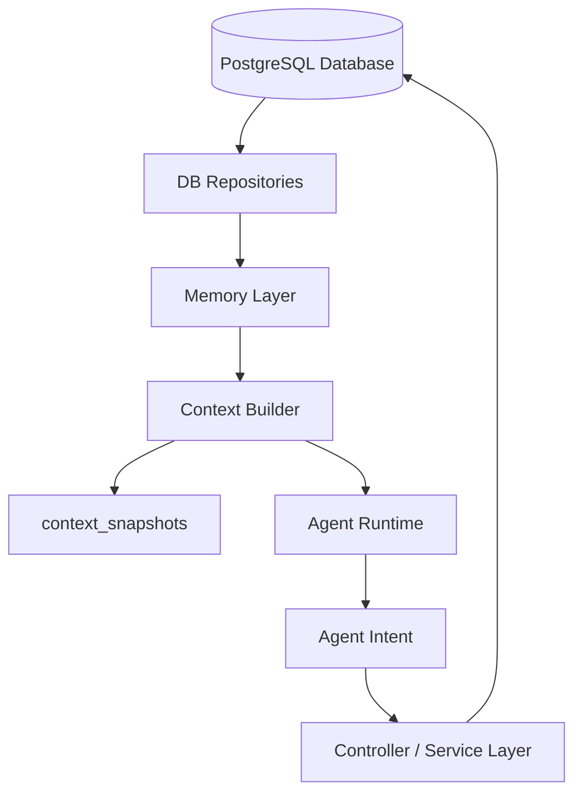
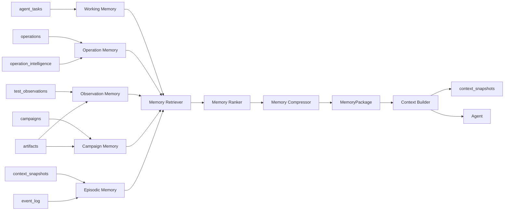
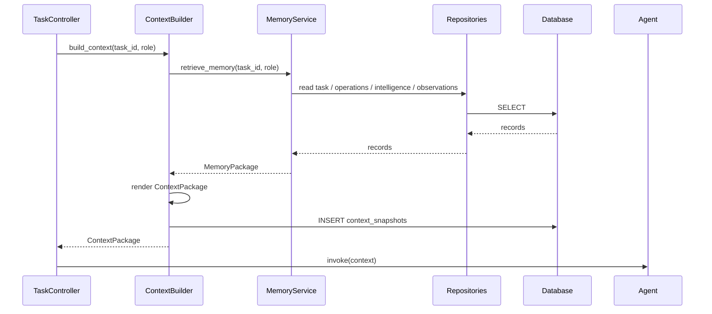
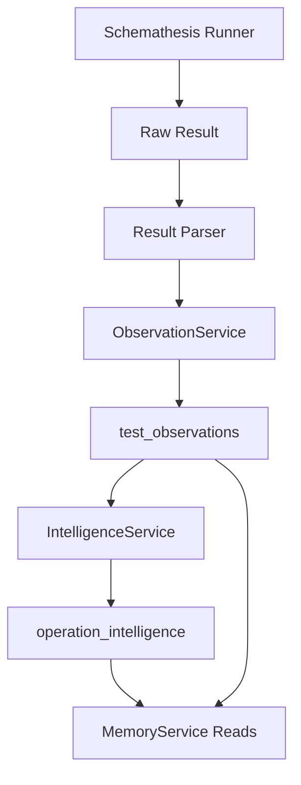

下面是一版可以直接放进项目里的：

```text
docs/memory-design.md
```

---

````markdown
# Agentic API Tester Memory 设计书

## 1. 设计目标

本设计用于定义 Agentic API Tester 中位于 **Database** 和 **Context Builder** 之间的 Memory 层。

系统已有数据库设计明确了核心边界：

- Database 保存事实。
- Test Intelligence 保存从事实中学习出的测试画像。
- Context Snapshot 保存某次 Agent 看到了什么。
- Agent 不直接写数据库，只输出结构化意图。
- Controller / Service 层校验后提交数据库变更。:contentReference[oaicite:0]{index=0}

因此，Memory 层的目标不是替代数据库，也不是新增一个“万能记忆表”，而是：

```text
从数据库中读取事实、画像、观察、历史执行记录和测试知识，
将它们整理成可检索、可排序、可压缩、可追溯的测试经验，
再交给 Context Builder 组装成某次 Agent 调用的上下文。
````

---

## 2. 核心原则

```text
Database = 事实存储层
Memory = 测试经验访问层
Context = 单次 Agent 调用输入层
Agent = 基于 Context 输出结构化意图
```

Memory 层必须遵守以下原则：

```text
1. Memory 不直接替代数据库。
2. Memory 不直接运行测试。
3. Memory 不直接调用 Schemathesis。
4. Memory 不直接调用 LLM。
5. Memory 不直接更新 agent_tasks.state。
6. Memory 不直接修改 operation_intelligence。
7. Memory 不直接写 test_observations。
8. Memory 不直接启用 test_checks。
9. Memory 必须保留 source_refs，保证每条记忆可追溯。
10. MVP 阶段不新增 memory 表，优先复用已有数据库表。
```

---

## 3. Memory 在系统中的位置



Memory 层处于：

```text
db/repositories
    ↓
memory
    ↓
context_engineering
    ↓
agent_runtime
```

---

## 4. Database / Memory / Context 边界

| 层        | 作用                            |           生命周期 | 是否直接给 Agent |
| -------- | ----------------------------- | -------------: | ----------: |
| Database | 保存原始事实、执行记录、测试观察、动态画像、审计日志    |             长期 |           否 |
| Memory   | 从 Database 抽取、归纳、排序、压缩测试经验    | 长期 / 中期 / 当前任务 |           否 |
| Context  | 某次 Agent 调用前的 prompt-ready 输入 |           单次调用 |           是 |

示例：

```text
Database:
  test_observations 记录：
  POST /v1/invoices amount=-1 导致 500。

Memory:
  createInvoice.amount 对负数边界敏感；
  历史上重复触发 server_error；
  建议优先测试 -1、0、极大值。

Context:
  Planner 本轮看到：
  - POST /v1/invoices dynamic_risk_score=0.87
  - amount negative boundary previously caused server_error
  - recommended strategy: boundary fuzzing + regression retest
```

---

## 5. Memory 类型

Memory 层分为 7 类：

```text
1. Working Memory
2. Operation Memory
3. Observation Memory
4. Constraint Memory
5. Campaign Memory
6. Testing Knowledge Memory
7. Episodic Memory
```

---

## 6. Memory 类型与数据库来源映射

| Memory 类型                | 数据库来源                                                                                   | MVP 是否实现 | 说明                      |
| ------------------------ | --------------------------------------------------------------------------------------- | -------: | ----------------------- |
| Working Memory           | `agent_tasks`                                                                           |        是 | 当前任务状态、预算、cycle、当前假设    |
| Operation Memory         | `operations`, `operation_intelligence`                                                  |        是 | API 静态目录 + 动态测试画像       |
| Observation Memory       | `test_observations`, `artifacts`                                                        |        是 | 历史失败、异常、reproducer、去重观察 |
| Campaign Memory          | `campaigns`, `artifacts`                                                                |        是 | 跑过什么、结果摘要、测试预算消耗        |
| Episodic Memory          | `context_snapshots`, `event_log`                                                        |        是 | 系统事件、Agent 调用历史、审计回放    |
| Constraint Memory        | `learned_operation_constraints`, `learned_parameter_constraints`, `constraint_evidence` |       后续 | 学到的 operation / 参数约束    |
| Testing Knowledge Memory | `testing_knowledge`, `test_checks`, `check_constraint_sources`                          |       后续 | 通用测试知识和可执行 checks       |

MVP 阶段只需要：

```text
Working Memory
Operation Memory
Observation Memory
Campaign Memory
Episodic Memory
```

暂时不实现：

```text
Constraint Memory
Testing Knowledge DB Memory
Vector Memory
Embedding Search
```

---

## 7. Memory 总体数据流



---

## 8. Memory 读路径

Memory 读路径发生在 Agent 调用之前。



---

## 9. Memory 写路径

MVP 阶段，MemoryService 本身不写数据库。

长期记忆来源由其他服务写入：



写入边界：

| 模块                    | 写入表                                                             |
| --------------------- | --------------------------------------------------------------- |
| `ObservationService`  | `test_observations`, 后续 `observation_events`                    |
| `IntelligenceService` | `operation_intelligence`, 后续 `learned_*`, `constraint_evidence` |
| `ContextBuilder`      | `context_snapshots`, `artifacts`, `event_log`                   |
| `TaskController`      | `agent_tasks`, `event_log`                                      |
| `CampaignController`  | `campaigns`, `agent_tasks`, `event_log`                         |
| `MemoryService`       | MVP 阶段不写业务表                                                     |

---

## 10. Memory 模块目录设计

推荐新增：

```text
src/agentic_api_tester/memory/
├── __init__.py
│
├── schemas.py
├── memory_service.py
├── memory_query.py
├── memory_package.py
├── memory_policy.py
├── memory_ranker.py
├── memory_selector.py
├── memory_compressor.py
│
├── stores/
│   ├── __init__.py
│   ├── working_memory_store.py
│   ├── operation_memory_store.py
│   ├── observation_memory_store.py
│   ├── campaign_memory_store.py
│   ├── episodic_memory_store.py
│   ├── constraint_memory_store.py
│   └── testing_knowledge_store.py
│
├── retrievers/
│   ├── __init__.py
│   ├── planner_memory_retriever.py
│   ├── result_analyst_memory_retriever.py
│   ├── decision_memory_retriever.py
│   ├── check_designer_memory_retriever.py
│   └── intelligence_updater_memory_retriever.py
│
└── policies/
    ├── planner_policy.py
    ├── result_analyst_policy.py
    ├── decision_policy.py
    ├── check_designer_policy.py
    └── intelligence_updater_policy.py
```

MVP 可先简化为：

```text
memory/
├── schemas.py
├── memory_service.py
├── memory_ranker.py
├── memory_compressor.py
└── stores/
    ├── working_memory_store.py
    ├── operation_memory_store.py
    ├── observation_memory_store.py
    ├── campaign_memory_store.py
    └── episodic_memory_store.py
```

---

## 11. 核心对象设计

### 11.1 `MemoryKind`

```python
from typing import Literal

MemoryKind = Literal[
    "working",
    "operation",
    "observation",
    "constraint",
    "campaign",
    "testing_knowledge",
    "episodic",
]
```

---

### 11.2 `MemoryItem`

```python
from typing import Any
from pydantic import BaseModel, Field


class MemoryItem(BaseModel):
    id: str
    kind: MemoryKind

    schema_id: str | None = None
    task_id: str | None = None
    operation_id: str | None = None
    campaign_id: str | None = None
    observation_id: str | None = None

    title: str
    content: str
    structured: dict[str, Any] = Field(default_factory=dict)

    importance: float = 0.5
    confidence: float = 0.5
    recency_score: float = 0.5
    relevance_score: float = 0.5
    risk_score: float = 0.0

    source_table: str
    source_id: str
```

说明：

```text
MemoryItem 不是数据库表。
MemoryItem 是 Memory 层对数据库 record 的统一抽象。
```

---

### 11.3 `MemoryQuery`

```python
from typing import Literal
from pydantic import BaseModel, Field


MemoryRole = Literal[
    "planner",
    "result_analyst",
    "decision_maker",
    "check_designer",
    "intelligence_updater",
]


class MemoryQuery(BaseModel):
    schema_id: str
    task_id: str | None = None
    campaign_id: str | None = None

    role: MemoryRole

    operation_ids: list[str] = Field(default_factory=list)
    focus_keywords: list[str] = Field(default_factory=list)
    include_kinds: list[MemoryKind] = Field(default_factory=list)

    max_items: int = 40
    token_budget: int = 6000
```

---

### 11.4 `MemoryPackage`

```python
from pydantic import BaseModel, Field


class MemoryPackage(BaseModel):
    schema_id: str
    task_id: str | None
    role: MemoryRole

    working_memory: list[MemoryItem] = Field(default_factory=list)
    operation_memory: list[MemoryItem] = Field(default_factory=list)
    observation_memory: list[MemoryItem] = Field(default_factory=list)
    constraint_memory: list[MemoryItem] = Field(default_factory=list)
    campaign_memory: list[MemoryItem] = Field(default_factory=list)
    testing_knowledge_memory: list[MemoryItem] = Field(default_factory=list)
    episodic_memory: list[MemoryItem] = Field(default_factory=list)

    selected_operation_ids: list[str] = Field(default_factory=list)

    source_refs: dict[str, list[str]] = Field(default_factory=dict)
    estimated_tokens: int = 0
```

`source_refs` 示例：

```json
{
  "operations": ["op_001", "op_002"],
  "operation_intelligence": ["op_001", "op_002"],
  "test_observations": ["obs_001", "obs_009"],
  "campaigns": ["camp_003"],
  "event_log": ["1021", "1022"]
}
```

---

## 12. Memory Store 设计

Memory Store 是 Repository 之上的读取适配层。

它的职责是：

```text
1. 读取数据库 record。
2. 转换成 MemoryItem。
3. 保留 source_table / source_id。
4. 不做复杂策略决策。
5. 不写数据库。
```

---

### 12.1 `WorkingMemoryStore`

来源表：

```text
agent_tasks
```

职责：

```text
读取当前 task 的状态、cycle、预算、当前假设、选中 operation。
```

接口：

```python
class WorkingMemoryStore:
    def __init__(self, task_repo):
        self.task_repo = task_repo

    def get_current_task_memory(self, task_id: str) -> list[MemoryItem]:
        ...
```

MemoryItem 示例：

```json
{
  "id": "mem_working_task_001",
  "kind": "working",
  "task_id": "task_001",
  "title": "Current task state",
  "content": "Task is in planning state, cycle_index=2, remaining campaign budget=3.",
  "structured": {
    "state": "planning",
    "cycle_index": 2,
    "selected_operation_ids": ["op_001", "op_002"],
    "current_hypotheses": [
      "POST /orders may accept invalid quantity"
    ]
  },
  "source_table": "agent_tasks",
  "source_id": "task_001"
}
```

---

### 12.2 `OperationMemoryStore`

来源表：

```text
operations
operation_intelligence
```

职责：

```text
读取 operation 静态目录和动态测试画像。
```

接口：

```python
class OperationMemoryStore:
    def __init__(self, operation_repo, intelligence_repo):
        self.operation_repo = operation_repo
        self.intelligence_repo = intelligence_repo

    def list_high_risk_operations(
        self,
        schema_id: str,
        limit: int,
    ) -> list[MemoryItem]:
        ...

    def get_operation_memory(
        self,
        operation_ids: list[str],
    ) -> list[MemoryItem]:
        ...

    def list_not_recently_tested_operations(
        self,
        schema_id: str,
        limit: int,
    ) -> list[MemoryItem]:
        ...
```

MemoryItem 示例：

```json
{
  "id": "mem_op_op_create_invoice",
  "kind": "operation",
  "schema_id": "schema_001",
  "operation_id": "op_create_invoice",
  "title": "POST /v1/invoices",
  "content": "Create invoice. Mutating operation. dynamic_risk_score=0.82. Historical server errors observed around amount boundary values.",
  "structured": {
    "method": "POST",
    "path": "/v1/invoices",
    "mutability": "create",
    "static_risk_score": 0.62,
    "dynamic_risk_score": 0.82,
    "failure_density": 0.31,
    "flake_rate": 0.03,
    "recommended_checks": [
      "response_schema",
      "negative_amount_boundary"
    ]
  },
  "importance": 0.9,
  "confidence": 0.78,
  "risk_score": 0.82,
  "source_table": "operation_intelligence",
  "source_id": "op_create_invoice"
}
```

---

### 12.3 `ObservationMemoryStore`

来源表：

```text
test_observations
artifacts
```

职责：

```text
读取历史异常、失败、疑似问题、reproducer 引用。
```

接口：

```python
class ObservationMemoryStore:
    def __init__(self, observation_repo, artifact_repo):
        self.observation_repo = observation_repo
        self.artifact_repo = artifact_repo

    def list_recent_for_operations(
        self,
        schema_id: str,
        operation_ids: list[str],
        limit_per_operation: int,
    ) -> list[MemoryItem]:
        ...

    def list_open_issues(
        self,
        schema_id: str,
        limit: int,
    ) -> list[MemoryItem]:
        ...

    def list_regression_candidates(
        self,
        schema_id: str,
        limit: int,
    ) -> list[MemoryItem]:
        ...
```

MemoryItem 示例：

```json
{
  "id": "mem_obs_obs_001",
  "kind": "observation",
  "schema_id": "schema_001",
  "task_id": "task_001",
  "operation_id": "op_create_invoice",
  "campaign_id": "camp_001",
  "observation_id": "obs_001",
  "title": "server_error on POST /v1/invoices",
  "content": "amount=-1 caused HTTP 500. Seen 4 times. Last seen in camp_001.",
  "structured": {
    "observation_type": "server_error",
    "severity": "high",
    "confidence": 0.86,
    "dedupe_key": "POST:/v1/invoices:server_error:amount_negative",
    "occurrence_count": 4,
    "status": "observed",
    "request_summary": {
      "body": {
        "amount": -1
      }
    },
    "response_summary": {
      "status_code": 500
    },
    "reproducer_artifact_id": "artifact_001"
  },
  "importance": 0.92,
  "confidence": 0.86,
  "recency_score": 0.8,
  "source_table": "test_observations",
  "source_id": "obs_001"
}
```

Observation Memory 不应包含：

```text
1. 完整 request body
2. 完整 response body
3. 完整日志
4. 大型 stack trace
5. 大型 artifact 内容
```

只保留摘要和 artifact 引用。

---

### 12.4 `CampaignMemoryStore`

来源表：

```text
campaigns
artifacts
```

职责：

```text
读取过去跑过什么、跑得怎么样、是否重复测试、预算消耗情况。
```

接口：

```python
class CampaignMemoryStore:
    def __init__(self, campaign_repo, artifact_repo):
        self.campaign_repo = campaign_repo
        self.artifact_repo = artifact_repo

    def list_recent_campaigns(
        self,
        task_id: str,
        limit: int,
    ) -> list[MemoryItem]:
        ...

    def summarize_campaign_history(
        self,
        task_id: str,
    ) -> MemoryItem:
        ...
```

MemoryItem 示例：

```json
{
  "id": "mem_campaign_camp_001",
  "kind": "campaign",
  "task_id": "task_001",
  "campaign_id": "camp_001",
  "title": "risk_targeted_fuzzing campaign completed",
  "content": "Targeted fuzzing campaign covered 8 operations, produced 3 observations, 1 high severity server_error.",
  "structured": {
    "campaign_type": "risk_targeted_fuzzing",
    "status": "completed",
    "covered_operation_count": 8,
    "observation_count": 3,
    "high_severity_count": 1,
    "artifact_bundle_uri": "artifact://..."
  },
  "source_table": "campaigns",
  "source_id": "camp_001"
}
```

---

### 12.5 `EpisodicMemoryStore`

来源表：

```text
context_snapshots
event_log
```

职责：

```text
读取最近系统事件、Agent 决策历史、上下文快照记录。
```

接口：

```python
class EpisodicMemoryStore:
    def __init__(self, context_snapshot_repo, event_log_repo):
        self.context_snapshot_repo = context_snapshot_repo
        self.event_log_repo = event_log_repo

    def list_recent_task_events(
        self,
        task_id: str,
        limit: int,
    ) -> list[MemoryItem]:
        ...

    def get_last_context_snapshot_ref(
        self,
        task_id: str,
        role: str,
    ) -> MemoryItem | None:
        ...
```

默认策略：

```text
Planner:
  只需要少量 episodic memory。

Result Analyst:
  需要当前 campaign 相关事件。

Decision Maker:
  需要最近 decision_made、campaign_finished、intelligence_updated 事件。

Debug / Replay:
  可以加载完整 episodic memory。
```

---

### 12.6 `ConstraintMemoryStore`

增强阶段实现。

来源表：

```text
learned_operation_constraints
learned_parameter_constraints
constraint_evidence
```

职责：

```text
读取已学习的 operation / 参数约束及其证据。
```

接口：

```python
class ConstraintMemoryStore:
    def list_constraints_for_operations(
        self,
        schema_id: str,
        operation_ids: list[str],
        min_confidence: float = 0.6,
    ) -> list[MemoryItem]:
        ...

    def list_candidate_constraints(
        self,
        schema_id: str,
        limit: int,
    ) -> list[MemoryItem]:
        ...
```

---

### 12.7 `TestingKnowledgeStore`

增强阶段实现。

来源表：

```text
testing_knowledge
test_checks
check_constraint_sources
```

MVP 阶段可以先用文件：

```text
knowledge/
├── rest_semantics.md
├── auth_testing.md
├── pagination.md
├── idempotency.md
├── schemathesis_usage.md
└── stateful_testing.md
```

接口：

```python
class TestingKnowledgeStore:
    def retrieve_by_role(
        self,
        role: str,
        operation_memory: list[MemoryItem],
        limit: int,
    ) -> list[MemoryItem]:
        ...

    def retrieve_by_categories(
        self,
        categories: list[str],
        limit: int,
    ) -> list[MemoryItem]:
        ...
```

---

## 13. 不同 Agent 角色的 Memory 策略

### 13.1 Planner Memory

Planner 需要回答：

```text
下一轮应该测什么？
为什么测这些 operation？
应该 broad test、targeted fuzzing、stateful workflow、retest 还是 report？
```

Planner 应读取：

| Memory 类型                | 是否需要 | 说明                  |
| ------------------------ | ---: | ------------------- |
| Working Memory           |    是 | 当前任务状态、预算、cycle     |
| Operation Memory         |    是 | operation 静态信息和动态风险 |
| Observation Memory       |    是 | 历史失败摘要              |
| Campaign Memory          |    是 | 避免重复测试              |
| Constraint Memory        |   后续 | 用于更聪明的输入生成          |
| Testing Knowledge Memory |   后续 | 通用测试策略              |
| Episodic Memory          |   少量 | 最近关键事件即可            |

---

### 13.2 Result Analyst Memory

Result Analyst 需要回答：

```text
这次测试结果说明了什么？
哪些 failure 是新 observation？
哪些是重复 observation？
哪些像 flake？
哪些像 spec issue？
哪些像 environment issue？
```

Result Analyst 应读取：

| Memory 类型          | 是否需要 | 说明                            |
| ------------------ | ---: | ----------------------------- |
| Working Memory     |    是 | 当前 task 和 active campaign     |
| Operation Memory   |    是 | 被测 operation 背景               |
| Observation Memory |    是 | 用于 dedupe 和历史对比               |
| Campaign Memory    |    是 | 当前 campaign spec 和历史 campaign |
| Episodic Memory    |   少量 | 当前 run 相关事件                   |
| Constraint Memory  |   后续 | 判断是否违反已学习约束                   |

---

### 13.3 Decision Maker Memory

Decision Maker 需要回答：

```text
下一步继续测试、复测、暂停、生成报告，还是进入 check 设计？
```

Decision Maker 应读取：

| Memory 类型          | 是否需要 | 说明               |
| ------------------ | ---: | ---------------- |
| Working Memory     |    是 | 状态、预算、blocker    |
| Operation Memory   |    是 | 剩余风险             |
| Observation Memory |    是 | 未处理问题            |
| Campaign Memory    |    是 | 已跑历史和收益          |
| Episodic Memory    |    是 | 最近决策链路           |
| Constraint Memory  |   后续 | 是否已有足够证据沉淀 check |

---

### 13.4 Check Designer Memory

Check Designer 需要回答：

```text
哪些 learned constraint 可以变成 executable check？
check 应该验证什么？
需要哪些证据？
```

Check Designer 应读取：

| Memory 类型                | 是否需要 | 说明                           |
| ------------------------ | ---: | ---------------------------- |
| Operation Memory         |    是 | operation schema、method、path |
| Observation Memory       |    是 | 高置信失败证据                      |
| Constraint Memory        |    是 | 候选约束                         |
| Testing Knowledge Memory |    是 | check template 和规则设计知识       |
| Campaign Memory          |   少量 | 验证 check 的历史 campaign        |

---

## 14. Memory Ranking

MemoryService 不应把所有信息交给 Context Builder。

应先排序。

推荐评分公式：

```text
final_score =
  0.35 * relevance_score
+ 0.25 * importance
+ 0.20 * confidence
+ 0.10 * recency_score
+ 0.10 * risk_score
```

字段解释：

| 字段                | 含义                                           |
| ----------------- | -------------------------------------------- |
| `relevance_score` | 与当前 role、operation、focus keywords 的相关性       |
| `importance`      | 严重程度、是否重复出现、是否影响高风险 operation                |
| `confidence`      | observation / constraint / intelligence 的置信度 |
| `recency_score`   | 最近是否出现                                       |
| `risk_score`      | `static_risk_score` 或 `dynamic_risk_score`   |

实现示例：

```python
class MemoryRanker:
    def rank(
        self,
        items: list[MemoryItem],
        query: MemoryQuery,
    ) -> list[MemoryItem]:
        return sorted(
            items,
            key=lambda item: self.score(item, query),
            reverse=True,
        )

    def score(self, item: MemoryItem, query: MemoryQuery) -> float:
        return (
            0.35 * item.relevance_score
            + 0.25 * item.importance
            + 0.20 * item.confidence
            + 0.10 * item.recency_score
            + 0.10 * item.risk_score
        )
```

---

## 15. Memory Compression

Memory 压缩的目标：

```text
在不丢失关键测试经验的前提下，减少 Context token 占用。
```

---

### 15.1 Observation 压缩

多个相同 `dedupe_key` 的 observation 不应展开。

压缩为：

```text
- observation_type
- severity
- confidence
- occurrence_count
- first_seen_at
- last_seen_at
- 代表性 request summary
- 代表性 response summary
- reproducer_artifact_id
```

---

### 15.2 Campaign 压缩

多个 campaign 压缩为：

```text
- 最近跑过哪些 campaign_type
- 覆盖了哪些 operation
- 哪些 operation 失败最多
- 哪些测试收益较低
- 预算消耗情况
```

---

### 15.3 Operation 压缩

operation 很多时，优先保留：

```text
1. dynamic_risk_score 高的 operation
2. static_risk_score 高的 operation
3. mutating operation
4. auth-sensitive operation
5. recently failed operation
6. not-yet-tested operation
7. selected_operation_ids 中的 operation
```

优先丢弃：

```text
1. 长期稳定的简单 GET
2. 最近已测试且没有 observation 的低风险 operation
3. 没有 request body、没有 path param、没有 auth 的低风险 operation
```

---

## 16. MemoryService 设计

### 16.1 接口

```python
class MemoryService:
    def __init__(
        self,
        working_store: WorkingMemoryStore,
        operation_store: OperationMemoryStore,
        observation_store: ObservationMemoryStore,
        campaign_store: CampaignMemoryStore,
        episodic_store: EpisodicMemoryStore,
        ranker: MemoryRanker,
        compressor: MemoryCompressor,
    ):
        ...

    def retrieve_for_planner(
        self,
        *,
        task_id: str,
        schema_id: str,
        token_budget: int,
    ) -> MemoryPackage:
        ...

    def retrieve_for_result_analyst(
        self,
        *,
        task_id: str,
        schema_id: str,
        campaign_id: str,
        operation_ids: list[str],
        token_budget: int,
    ) -> MemoryPackage:
        ...

    def retrieve_for_decision_maker(
        self,
        *,
        task_id: str,
        schema_id: str,
        token_budget: int,
    ) -> MemoryPackage:
        ...

    def retrieve_for_check_designer(
        self,
        *,
        task_id: str,
        schema_id: str,
        operation_ids: list[str],
        token_budget: int,
    ) -> MemoryPackage:
        ...
```

---

### 16.2 Planner Retrieval 伪代码

```python
def retrieve_for_planner(
    self,
    *,
    task_id: str,
    schema_id: str,
    token_budget: int,
) -> MemoryPackage:
    working = self.working_store.get_current_task_memory(task_id)

    selected_operation_ids = extract_selected_operation_ids(working)

    high_risk_ops = self.operation_store.list_high_risk_operations(
        schema_id=schema_id,
        limit=30,
    )

    selected_ops = self.operation_store.get_operation_memory(
        operation_ids=selected_operation_ids,
    )

    operation_items = merge_unique_memory_items(
        high_risk_ops,
        selected_ops,
    )

    observations = self.observation_store.list_recent_for_operations(
        schema_id=schema_id,
        operation_ids=[
            item.operation_id
            for item in operation_items
            if item.operation_id is not None
        ],
        limit_per_operation=3,
    )

    campaigns = self.campaign_store.list_recent_campaigns(
        task_id=task_id,
        limit=5,
    )

    episodic = self.episodic_store.list_recent_task_events(
        task_id=task_id,
        limit=10,
    )

    all_items = [
        *working,
        *operation_items,
        *observations,
        *campaigns,
        *episodic,
    ]

    query = MemoryQuery(
        schema_id=schema_id,
        task_id=task_id,
        role="planner",
        token_budget=token_budget,
    )

    ranked = self.ranker.rank(all_items, query)
    compressed = self.compressor.fit_budget(ranked, token_budget)

    return MemoryPackage.from_items(
        schema_id=schema_id,
        task_id=task_id,
        role="planner",
        items=compressed,
    )
```

---

## 17. ContextBuilder 如何使用 Memory

ContextBuilder 不再直接从大量 repository 中拼上下文，而是：

```text
ContextBuilder
    → MemoryService
    → MemoryPackage
    → render ContextPackage
    → write context_snapshot artifact
    → INSERT context_snapshots
```

接口示例：

```python
class ContextBuilder:
    def __init__(
        self,
        memory_service: MemoryService,
        artifact_service,
        context_snapshot_repo,
    ):
        ...

    def build_for_planner(
        self,
        task_id: str,
        schema_id: str,
    ) -> ContextPackage:
        memory_package = self.memory_service.retrieve_for_planner(
            task_id=task_id,
            schema_id=schema_id,
            token_budget=6000,
        )

        context = self.render_planner_context(memory_package)

        artifact = self.artifact_service.write_context_snapshot(context)

        snapshot = self.context_snapshot_repo.create(
            task_id=task_id,
            schema_id=schema_id,
            role="planner",
            cycle_index=context.cycle_index,
            artifact_uri=artifact.uri,
            source_refs_json=memory_package.source_refs,
            total_estimated_tokens=context.estimated_tokens,
            prompt_version="planner_v1",
            model_name=context.model_name,
        )

        return context
```

---

## 18. Memory 与 Context 的输出区别

### 18.1 MemoryPackage

偏结构化：

```json
{
  "operation_memory": [
    {
      "operation_id": "op_create_invoice",
      "title": "POST /v1/invoices",
      "importance": 0.91,
      "content": "High-risk mutating endpoint. Repeated server errors around amount boundary.",
      "structured": {
        "dynamic_risk_score": 0.87,
        "recommended_checks": [
          "negative_boundary",
          "response_schema"
        ]
      }
    }
  ]
}
```

### 18.2 ContextPackage

偏 prompt-ready：

```markdown
## High-risk operations

### POST /v1/invoices

- Dynamic risk: 0.87
- Mutability: create
- Historical failures:
  - amount=-1 caused server_error, occurrence_count=4
- Recommended strategy:
  - Boundary fuzzing
  - Regression retest
```

边界：

```text
Memory 负责选什么。
Context 负责怎么呈现给 Agent。
```

---

## 19. 是否需要新增 Memory 表

MVP 不需要。

原因：

```text
1. 当前核心实体都是结构化的。
2. operation_id、schema_id、campaign_id、observation_type、risk_score 足够支撑检索。
3. 过早增加 memory_index 容易造成事实、观察、归纳、上下文混淆。
4. 当前最重要的是跑通测试闭环。
```

MVP 直接使用：

```text
agent_tasks
operations
operation_intelligence
test_observations
campaigns
artifacts
context_snapshots
event_log
```

作为 memory source。

---

## 20. 后续可选 Memory Index 表

增强阶段可以新增统一 memory 索引表。

```sql
CREATE TABLE memory_index (
  id TEXT PRIMARY KEY,

  schema_id TEXT,
  task_id TEXT,
  operation_id TEXT,

  memory_kind TEXT NOT NULL,

  source_table TEXT NOT NULL,
  source_id TEXT NOT NULL,

  title TEXT NOT NULL,
  content TEXT NOT NULL,
  structured_json JSONB DEFAULT '{}',

  importance NUMERIC DEFAULT 0.5,
  confidence NUMERIC DEFAULT 0.5,
  status TEXT NOT NULL DEFAULT 'active',

  created_at TIMESTAMPTZ DEFAULT now(),
  updated_at TIMESTAMPTZ DEFAULT now()
);

CREATE INDEX idx_memory_index_schema_kind
ON memory_index(schema_id, memory_kind);

CREATE INDEX idx_memory_index_operation_kind
ON memory_index(operation_id, memory_kind);

CREATE INDEX idx_memory_index_source
ON memory_index(source_table, source_id);
```

如果后续需要向量检索，可以再加：

```sql
CREATE TABLE memory_embeddings (
  memory_id TEXT PRIMARY KEY REFERENCES memory_index(id),
  embedding_model TEXT NOT NULL,
  embedding_vector vector,
  embedded_at TIMESTAMPTZ DEFAULT now()
);
```

但这不是 MVP 内容。

---

## 21. Memory 写入边界

| 模块                  | 是否允许写 Memory 源数据 | 说明                                                |
| ------------------- | ---------------: | ------------------------------------------------- |
| Agent               |                否 | 只能输出结构化意图                                         |
| MemoryService       |            MVP 否 | 只读、排序、压缩                                          |
| ObservationService  |                是 | 写 `test_observations`                             |
| IntelligenceService |                是 | 写 `operation_intelligence`、后续 learned constraints |
| ContextBuilder      |                是 | 写 `context_snapshots`                             |
| TaskController      |                是 | 写 `agent_tasks`                                   |
| CampaignController  |                是 | 写 `campaigns`                                     |
| CheckRegistry       |                是 | 写 `test_checks`                                   |

禁止：

```text
Agent 直接写 Memory。
MemoryService 直接替代 IntelligenceService。
MemoryService 直接修改 operation_intelligence。
MemoryService 直接插入 test_observations。
MemoryService 直接更新 agent_tasks.state。
```

---

## 22. 实现顺序

MVP 建议按以下顺序实现：

```text
1. memory/schemas.py
2. memory/stores/working_memory_store.py
3. memory/stores/operation_memory_store.py
4. memory/stores/observation_memory_store.py
5. memory/stores/campaign_memory_store.py
6. memory/memory_ranker.py
7. memory/memory_compressor.py
8. memory/memory_service.py
9. ContextBuilder 改为调用 MemoryService
10. 保存 context_snapshots.source_refs_json
11. 增加 episodic_memory_store
12. 后续再实现 constraint_memory_store
13. 后续再实现 testing_knowledge_store
14. 后续再考虑 memory_index / embedding
```

第一条必须跑通的链路：

```text
operations
+ operation_intelligence
+ test_observations
+ campaigns
+ agent_tasks
    ↓
MemoryService.retrieve_for_planner()
    ↓
MemoryPackage
    ↓
ContextBuilder
    ↓
ContextSnapshot
    ↓
Planner Agent
```

---

## 23. 测试策略

### 23.1 Operation Memory 测试

```text
given schema 下有多个 operations
and operation_intelligence 中有 dynamic_risk_score
when retrieve_for_planner
then 返回高风险 operation memory
and 每个 MemoryItem 包含 source_table/source_id
```

---

### 23.2 Observation Memory 测试

```text
given 一个 operation 有多条 observations
when retrieve_for_planner
then 只返回最高价值 observation
and 不包含完整 raw artifact 内容
and 保留 reproducer_artifact_id
```

---

### 23.3 Working Memory 测试

```text
given agent_tasks.current_hypotheses 不为空
when retrieve_for_planner
then MemoryPackage 包含当前 hypotheses
```

---

### 23.4 Ranking 测试

```text
given 一个低风险 recent item
and 一个高风险 repeated server_error item
when rank
then repeated server_error item 排在前面
```

---

### 23.5 Source Refs 测试

```text
given MemoryPackage 包含 operation_intelligence 和 test_observations
when ContextBuilder 生成 context_snapshot
then context_snapshots.source_refs_json 包含来源表和来源 id
```

---

## 24. 最终设计结论

Memory 层是：

```text
数据库之上的测试经验访问层。
```

它负责：

```text
1. 从数据库读取 facts / intelligence / observations / campaigns / events。
2. 统一转换成 MemoryItem。
3. 根据 Agent role 检索不同类型记忆。
4. 对记忆进行排序、去重、压缩。
5. 输出 MemoryPackage。
6. 保留 source_refs，支持审计和 replay。
7. 将 MemoryPackage 交给 ContextBuilder。
```

它不负责：

```text
1. 写 observation。
2. 更新 intelligence。
3. 修改 task state。
4. 跑 Schemathesis。
5. 调 LLM。
6. 直接生成最终 prompt。
7. 决定 campaign 是否安全。
```

最终主链路：

```text
Database
→ Repositories
→ Memory Stores
→ MemoryService
→ MemoryPackage
→ ContextBuilder
→ ContextSnapshot
→ Agent
→ Agent Intent
→ Controller / Service
→ Database
```